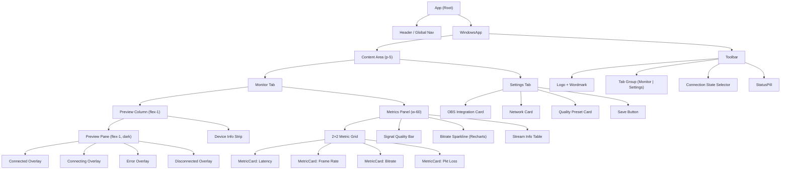
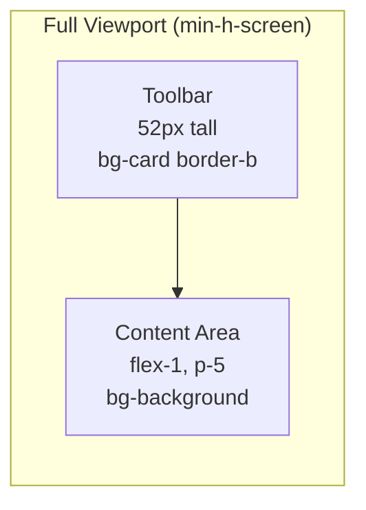
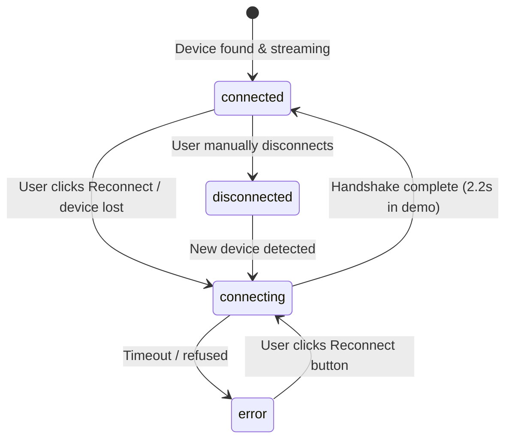
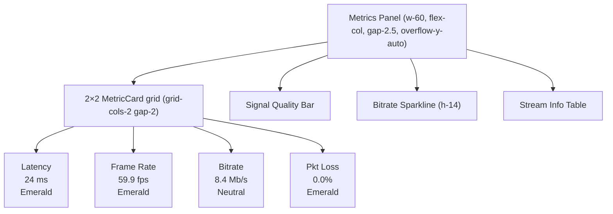
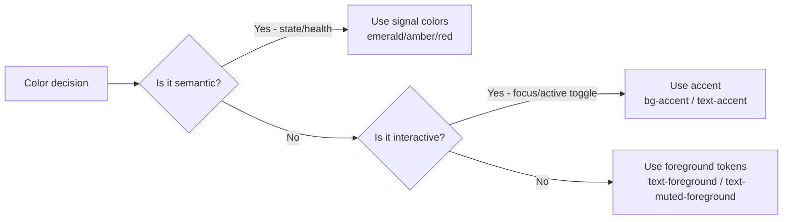

# Airframe — Windows Receiver: Complete Design Specification

**Version:** 2.4  
**Audience:** Junior developers recreating this interface from scratch  
**Stack:** React 18 + TypeScript, Tailwind CSS v4, Recharts, Lucide React

---

## Table of Contents

1. [Design Philosophy](#1-design-philosophy)
2. [Component Architecture](#2-component-architecture)
3. [Layout System](#3-layout-system)
4. [Design Tokens](#4-design-tokens)
5. [Typography](#5-typography)
6. [The Toolbar](#6-the-toolbar)
7. [The Monitor Tab](#7-the-monitor-tab)
   - 7a. [Preview Pane](#7a-preview-pane)
   - 7b. [Connection State Overlays](#7b-connection-state-overlays)
   - 7c. [Device Info Strip](#7c-device-info-strip)
   - 7d. [Metrics Panel](#7d-metrics-panel)
   - 7e. [Individual Metric Components](#7e-individual-metric-components)
8. [The Settings Tab](#8-the-settings-tab)
9. [Shared Primitives](#9-shared-primitives)
10. [Interactive Behaviors & State](#10-interactive-behaviors--state)
11. [Color Usage Rules](#11-color-usage-rules)
12. [Spacing Reference](#12-spacing-reference)
13. [Exact Reproduction Checklist](#13-exact-reproduction-checklist)

---

## 1. Design Philosophy

The Windows Receiver is a **monitoring tool**, not a control panel. The operator glances at it during a live production — it must communicate health at a glance without demanding attention. Every design decision follows from this constraint.

**Core principles applied to this interface:**

| Principle               | How it manifests                                                                                                           |
| ----------------------- | -------------------------------------------------------------------------------------------------------------------------- |
| Black/white primary     | All structural chrome is foreground/background. No decorative color.                                                       |
| Mono for machine values | Every number the app generates uses DM Mono. Human-authored text uses Figtree.                                             |
| Two-channel status      | Connection quality uses color AND a text label. Never color alone.                                                         |
| Functional motion only  | The only animation is the live tally pulse and the connecting spinner. Nothing decorates.                                  |
| Ground encodes context  | The preview pane is always `#0A0A09` (near-black) regardless of app theme — it represents a camera feed, not a UI surface. |

---

## 2. Component Architecture



---

## 3. Layout System

### Overall page structure

The Windows app is a **full-viewport column** — no browser chrome framing, no modal, no simulated window. It fills the page.



### Monitor tab — two-column split

```
┌─────────────────────────────────────────────────────────────────────┐
│  TOOLBAR  (bg-card, border-b, px-6, py-3)                           │
│  [AF logo] Airframe Receiver  [Monitor] [Settings]   [●] Connected  │
├───────────────────────────────────────────┬─────────────────────────┤
│                                           │                         │
│   PREVIEW PANE  (flex-1, rounded-2xl)     │  METRICS PANEL  (w-60) │
│   bg-[#0A0A09]                            │                         │
│                                           │  ┌────────┬────────┐   │
│   [viewfinder grid, corner brackets]      │  │Latency │Frame   │   │
│                                           │  │ 24 ms  │Rate    │   │
│   [center: focus reticle]                 │  │        │59.9fps │   │
│                                           │  ├────────┼────────┤   │
│   top-center: ● LIVE · 60fps · 8.4Mb/s   │  │Bitrate │Pkt Loss│   │
│                                           │  │ 8.4    │ 0.0%   │   │
│   bottom-left: device label (DM Mono)     │  └────────┴────────┘   │
│                                           │                         │
│                                           │  [Signal Quality bar]   │
│                                           │                         │
│                                           │  [Bitrate sparkline]    │
│                                           │                         │
│                                           │  [Stream info table]    │
│                                           │                         │
├───────────────────────────────────────────┴─────────────────────────┤
│  DEVICE INFO STRIP  (px-4 py-3, rounded-xl, bg-card border)         │
│  [📱] Pixel 8 Pro  192.168.1.42 · Android 14 · Port 4747  [↺] [●]  │
└─────────────────────────────────────────────────────────────────────┘
```

### Tailwind classes for the two-column split

```tsx
// Outer wrapper — fills content area
<div className="flex gap-4 h-full">
  {/* Left column — preview + device strip */}
  <div className="flex-1 flex flex-col gap-3 min-w-0">
    <div
      className="flex-1 rounded-2xl bg-[#0A0A09] overflow-hidden relative"
      style={{ minHeight: 340 }}
    >
      {/* preview content */}
    </div>
    {/* device strip */}
  </div>

  {/* Right column — metrics panel */}
  <div className="w-60 flex-shrink-0 flex flex-col gap-2.5 overflow-y-auto">
    {/* metric cards, chart, info */}
  </div>
</div>
```

**Critical sizing decisions:**

- `flex-1` on the preview column: it expands to fill all remaining horizontal space after the 240px metrics panel
- `w-60` = 240px fixed. Do not make this flexible — the metric cards need stable widths to prevent text reflow during live data updates
- `min-w-0` on the preview column: prevents flex overflow when content is long
- `gap-4` = 16px between columns
- `min-height: 340` on the preview pane ensures it never collapses too small on shorter viewports

---

## 4. Design Tokens

All values reference CSS custom properties set in `theme.css`. Never hardcode these — use the Tailwind classes that map to them.

### Light mode tokens

| Token           | CSS var              | Value             | Tailwind class              |
| --------------- | -------------------- | ----------------- | --------------------------- |
| Page background | `--background`       | `#F5F5F3`         | `bg-background`             |
| Card / panel bg | `--card`             | `#FFFFFF`         | `bg-card`                   |
| Muted surface   | `--muted`            | `#ECEAE6`         | `bg-muted`                  |
| Primary text    | `--foreground`       | `#0F0F0E`         | `text-foreground`           |
| Secondary text  | `--muted-foreground` | `#6B6B69`         | `text-muted-foreground`     |
| Accent (blue)   | `--accent`           | `#0054FA`         | `bg-accent` / `text-accent` |
| Border hairline | `--border`           | `rgba(0,0,0,.08)` | `border-border`             |
| Chart line/fill | `--chart-1`          | `#0054FA`         | `var(--chart-1)`            |

### Dark mode tokens (`.dark` class on `<html>`)

| Token           | CSS var              | Value                   |
| --------------- | -------------------- | ----------------------- |
| Page background | `--background`       | `#0C0C0B`               |
| Card / panel bg | `--card`             | `#161614`               |
| Muted surface   | `--muted`            | `#1E1E1C`               |
| Primary text    | `--foreground`       | `#F0F0EE`               |
| Secondary text  | `--muted-foreground` | `#8A8A88`               |
| Accent (blue)   | `--accent`           | `#4D8AFF`               |
| Border hairline | `--border`           | `rgba(255,255,255,.07)` |
| Chart line/fill | `--chart-1`          | `#4D8AFF`               |

### Signal / semantic colors (never from token system)

These are **not** CSS tokens. They are hardcoded Tailwind classes because they encode absolute meaning, not theme-relative aesthetics.

| Meaning              | Class                                 | Hex       |
| -------------------- | ------------------------------------- | --------- |
| Good / healthy       | `text-emerald-500` / `bg-emerald-500` | `#10B981` |
| Caution / degraded   | `text-amber-500` / `bg-amber-500`     | `#F59E0B` |
| Error / live tally   | `text-red-500` / `bg-red-500`         | `#EF4444` |
| No signal / inactive | `text-zinc-400` / `bg-zinc-400`       | `#A1A1AA` |

### Border radius

```css
--radius: 0.875rem; /* 14px — the base */
```

| Tailwind class | Value         | Used for                                     |
| -------------- | ------------- | -------------------------------------------- |
| `rounded-lg`   | 14px          | Cards, panels, metric cards                  |
| `rounded-xl`   | 18px (approx) | Input fields, small containers, device strip |
| `rounded-2xl`  | 22px (approx) | Preview pane, large cards                    |
| `rounded-full` | 9999px        | StatusPill, toggle thumb, signal dots        |

---

## 5. Typography

**Two fonts. One rule.**

- **Figtree** — everything a human authors: headings, labels, body copy, button text, descriptions
- **DM Mono** — everything the app generates: latency values, IP addresses, fps counts, bitrates, section headers that label data

Import both from Google Fonts:

```css
@import url("https://fonts.googleapis.com/css2?family=Figtree:wght@400;500;600;700&family=DM+Mono:wght@400;500&display=swap");
```

Set the base font on the root element:

```tsx
<div style={{ fontFamily: "Figtree, system-ui, sans-serif" }}>
```

Apply DM Mono inline where needed:

```tsx
style={{ fontFamily: "DM Mono, monospace" }}
```

### Type scale used in the Windows receiver

| Role                  | Font    | Weight | Size | Class / style                             |
| --------------------- | ------- | ------ | ---- | ----------------------------------------- |
| App name ("Airframe") | Figtree | 600    | 14px | `text-sm font-semibold tracking-tight`    |
| Tab labels            | Figtree | 500    | 14px | `text-sm font-medium`                     |
| Settings headings     | Figtree | 600    | 20px | `text-xl font-semibold tracking-tight`    |
| Settings descriptions | Figtree | 400    | 14px | `text-sm text-muted-foreground`           |
| Setting row labels    | Figtree | 500    | 14px | `text-sm font-medium`                     |
| Setting row sublabels | Figtree | 400    | 12px | `text-xs text-muted-foreground mt-0.5`    |
| Device name           | Figtree | 500    | 14px | `text-sm font-medium`                     |
| Section labels (mono) | DM Mono | 500    | 10px | `text-[10px] tracking-[0.15em] uppercase` |
| Metric values         | DM Mono | 500    | 22px | `text-[22px] font-medium tabular-nums`    |
| Metric units          | DM Mono | 400    | 12px | `text-xs`                                 |
| Device strip details  | DM Mono | 400    | 12px | `text-xs text-muted-foreground`           |
| Live overlay          | DM Mono | 400    | 12px | `text-xs`                                 |
| Chart tooltip         | DM Mono | 400    | 11px | `text-[11px]`                             |
| Stream info values    | DM Mono | 400    | 11px | `text-[11px]`                             |
| Stream info labels    | Figtree | 400    | 11px | `text-[11px] text-muted-foreground`       |

**The `tabular-nums` rule:** Every live-updating number (`latency`, `fps`, `bitrate`, `loss`) must use `tabular-nums`. This prevents the layout from shifting as values change width (e.g., "9" vs "24" vs "112").

**The `tracking-[0.15em] uppercase` rule on section labels:** DM Mono section headers like `LATENCY`, `SIGNAL QUALITY`, `STREAM INFO` use wide letter-spacing and uppercase to create hierarchy without adding visual weight. They recede, letting the large metric value lead.

---

## 6. The Toolbar

The toolbar is a single `flex` row. Height is determined by `py-3` padding + content, approximately 52px total.

```
┌──────────────────────────────────────────────────────────────────────┐
│ px-6 py-3  bg-card  border-b border-border                           │
│                                                                       │
│ [■ AF]  Airframe  Receiver │ [▶ Monitor] [⚙ Settings] │ [●] [pill]  │
│  logo   semibold  muted    │  tab group              │  selector    │
└──────────────────────────────────────────────────────────────────────┘
```

### Logo group (left)

```tsx
<div className="flex items-center gap-2">
  {/* Icon mark — 28px square */}
  <div className="size-7 rounded-lg bg-foreground flex items-center justify-center flex-shrink-0">
    <span
      className="text-background text-xs font-bold"
      style={{ fontFamily: "Figtree,sans-serif" }}
    >
      AF
    </span>
  </div>

  {/* Word mark */}
  <span className="font-semibold tracking-tight">Airframe</span>

  {/* Sub-label */}
  <span className="text-muted-foreground text-sm">
    Receiver
  </span>
</div>
```

**Icon mark spec:**

- Size: `size-7` = 28×28px
- Shape: `rounded-lg` (14px radius)
- Background: `bg-foreground` (near-black in light, near-white in dark — always high contrast)
- Text: "AF", `text-xs font-bold`, color `text-background` (inverted from bg)
- The mark is a 2-letter monogram, never an SVG icon

### Tab group (center-left)

Sits immediately right of the logo, separated by `ml-4`.

```tsx
<div className="flex items-center gap-0.5 ml-4">
  {["monitor", "settings"].map((tab) => (
    <button
      onClick={() => setTab(tab)}
      className={`flex items-center gap-1.5 px-3 py-1.5 rounded-lg text-sm font-medium transition-all duration-150 ${
        activeTab === tab
          ? "bg-muted text-foreground"
          : "text-muted-foreground hover:text-foreground"
      }`}
    >
      {tab === "monitor" ? (
        <Activity size={13} />
      ) : (
        <Settings size={13} />
      )}
      {tab.charAt(0).toUpperCase() + tab.slice(1)}
    </button>
  ))}
</div>
```

**Tab anatomy:**

- Icon: 13px lucide icon, left of label, `gap-1.5`
- Padding: `px-3 py-1.5` — 12px horizontal, 6px vertical
- Shape: `rounded-lg` (not pill — pills are for status badges)
- Active state: `bg-muted text-foreground` — fills with a soft muted background
- Inactive: `text-muted-foreground` — text only, no background
- Hover: `hover:text-foreground` — text brightens, no background change
- Transition: `duration-150` — fast, not laggy

**There is no underline or indicator bar.** Active state is a filled background, not a line. This feels calmer than a border-bottom indicator.

### Right side (state selector + status pill)

```tsx
<div className="ml-auto flex items-center gap-3">
  {/* Demo-only: connection state selector */}
  <select
    value={conn}
    onChange={(e) => setConn(e.target.value)}
    className="text-xs px-2.5 py-1.5 rounded-lg bg-muted border border-border
               text-muted-foreground outline-none cursor-pointer"
    style={{ fontFamily: "DM Mono,monospace" }}
  >
    <option value="connected">● Connected</option>
    <option value="connecting">◌ Connecting</option>
    <option value="disconnected">○ Disconnected</option>
    <option value="error">✕ Error</option>
  </select>

  {/* Status pill */}
  <StatusPill state={conn} />
</div>
```

`ml-auto` on the right group pushes it to the far right end of the flex row.

---

## 7. The Monitor Tab

### 7a. Preview Pane

The preview pane is the dominant element — it takes all remaining horizontal space (`flex-1`) and most of the vertical space.

**Container:**

```tsx
<div
  className="flex-1 rounded-2xl bg-[#0A0A09] overflow-hidden relative"
  style={{ minHeight: 340 }}
>
```

- Background is always `#0A0A09` (near-black), never adapts to theme. This is intentional: the pane represents a camera feed, which is always a dark environment.
- `overflow-hidden` clips the corner brackets and overlays at the rounded edges
- `relative` enables absolute-positioned overlays inside it
- `minHeight: 340` prevents it from collapsing to zero when the viewport is very short

**Connected state — the viewfinder aesthetic:**

When `conn === "connected"`, four visual layers are rendered inside the pane:

#### Layer 1: Viewfinder grid (rule-of-thirds)

```tsx
<div
  className="absolute inset-0 opacity-[0.028]"
  style={{
    backgroundImage:
      "linear-gradient(rgba(255,255,255,1) 1px, transparent 1px), " +
      "linear-gradient(90deg, rgba(255,255,255,1) 1px, transparent 1px)",
    backgroundSize: "33.33% 33.33%",
  }}
/>
```

- Covers the entire pane (`absolute inset-0`)
- Creates a 3×3 grid of cells, each exactly 1/3 of the pane width/height
- Grid lines are 1px white at `opacity-[0.028]` — barely visible but present, like a real camera viewfinder
- **Do not use a border or SVG grid.** The CSS background-image technique scales correctly at any pane size.

#### Layer 2: Corner brackets

Four L-shaped corner brackets, one at each corner of the pane. They look like a camera's crop frame indicators.

```tsx
{
  [
    ["top-3 left-3", "border-t border-l"], // top-left
    ["top-3 right-3", "border-t border-r"], // top-right
    ["bottom-12 left-3", "border-b border-l"], // bottom-left (avoids device label)
    ["bottom-12 right-3", "border-b border-r"], // bottom-right
  ].map(([pos, b], i) => (
    <div
      key={i}
      className={`absolute ${pos} size-4 ${b} border-white/20`}
    />
  ));
}
```

- Each bracket is a 16×16px (`size-4`) div with only two borders (making an L-shape)
- Positioned 12px (`top-3`/`right-3` etc) from the pane's edge
- Bottom brackets sit at `bottom-12` (48px from bottom) to leave room for the device label overlay
- `border-white/20` = 20% opacity white border — subtle, not distracting

#### Layer 3: Center focus reticle

A thin circle centered in the pane, representing the camera's autofocus point.

```tsx
<div className="absolute inset-0 flex items-center justify-center pointer-events-none">
  <div className="size-14 border border-white/[0.07] rounded-full" />
</div>
```

- `size-14` = 56px circle
- `border-white/[0.07]` = 7% opacity — barely visible, purely suggestive
- `pointer-events-none` — this is purely decorative, never intercepts clicks

#### Layer 4: Top-center live overlay

```tsx
<div className="absolute top-3 left-1/2 -translate-x-1/2">
  <div
    className="flex items-center gap-1.5 px-2.5 py-1 rounded-full
               bg-black/55 backdrop-blur-md border border-white/[0.08]
               text-white/70 text-xs"
    style={{ fontFamily: "DM Mono,monospace" }}
  >
    <span className="size-1.5 rounded-full bg-red-500 animate-pulse flex-shrink-0" />
    LIVE · {fps} fps · {bitrate} Mb/s
  </div>
</div>
```

- Position: `absolute top-3` = 12px from top, horizontally centered via `left-1/2 -translate-x-1/2`
- Background: `bg-black/55 backdrop-blur-md` — semi-transparent frosted pill that reads over any content
- Border: `border-white/[0.08]` — hairline white border at 8% opacity
- Red dot: `size-1.5 rounded-full bg-red-500 animate-pulse` — 6px red circle with CSS pulse animation. This is the only animation on the connected state.
- Text: `LIVE · 59 fps · 8.4 Mb/s` — all data generated by the app, all in DM Mono, `text-white/70`
- The fps and bitrate values update every 1000ms via `setInterval`

#### Layer 5: Bottom-left device label

```tsx
<div
  className="absolute bottom-3 left-4 text-white/30 text-[11px]"
  style={{ fontFamily: "DM Mono,monospace" }}
>
  Pixel 8 Pro — Main · 1920 × 1080 · H.264
</div>
```

- Sits 12px from bottom, 16px from left
- `text-white/30` = 30% opacity white — very subtle, only readable when you look for it
- Contains: device name, camera slot, resolution, codec — machine-generated data, so DM Mono

---

### 7b. Connection State Overlays

When the connection is not "connected", a full-screen overlay replaces the viewfinder content. All overlays use `absolute inset-0 flex flex-col items-center justify-center` — they fill the entire pane and center their content.



#### Connecting overlay

```
            ┌───────────────────────┐
            │                       │
            │    ◯  (spinner)       │
            │                       │
            │  Connecting ·         │
            │  192.168.1.42         │
            │                       │
            └───────────────────────┘
```

```tsx
<div className="absolute inset-0 flex flex-col items-center justify-center gap-4">
  {/* Spinner */}
  <div
    className="size-10 rounded-full border-2
                  border-white/10 border-t-white/50 animate-spin"
  />

  {/* Text */}
  <p
    className="text-white/50 text-sm"
    style={{ fontFamily: "DM Mono,monospace" }}
  >
    Connecting · 192.168.1.42
  </p>
</div>
```

- Spinner: 40px circle (`size-10`), `border-2` all around at `white/10` (10% white), one quadrant overridden to `border-t-white/50` (50% white top border). `animate-spin` rotates it continuously.
- Text: `text-white/50` — muted because this is a waiting state, not an actionable one

#### Error overlay

```
            ┌───────────────────────┐
            │                       │
            │    ⚠  (red icon)      │
            │                       │
            │  Connection lost      │
            │  192.168.1.42 · 0:32  │
            │                       │
            │  [↺ Reconnect]        │
            │                       │
            └───────────────────────┘
```

```tsx
<div className="absolute inset-0 flex flex-col items-center justify-center gap-3">
  <AlertCircle className="text-red-500/70" size={30} />
  <p className="text-white/65 text-sm font-medium">
    Connection lost
  </p>
  <p
    className="text-white/30 text-xs"
    style={{ fontFamily: "DM Mono,monospace" }}
  >
    192.168.1.42 · 0:32 ago
  </p>
  <button
    onClick={onReconnect}
    className="mt-2 flex items-center gap-2 px-4 py-2 rounded-xl
               bg-white/[0.08] border border-white/[0.12]
               text-white/75 text-sm hover:bg-white/[0.12] transition-colors"
  >
    <RefreshCw size={12} />
    Reconnect
  </button>
</div>
```

- Icon: `AlertCircle` from lucide-react, 30px, `text-red-500/70` (70% opacity red)
- "Connection lost": `text-white/65 font-medium` — readable but not alarming
- IP + time: `text-white/30` in DM Mono — secondary, machine-generated info
- Reconnect button: `bg-white/[0.08]` — ghost button on dark, barely visible background with a hairline border. Has `hover:bg-white/[0.12]` state. Icon (`RefreshCw` 12px) + text.

#### Disconnected overlay

```tsx
<div className="absolute inset-0 flex flex-col items-center justify-center gap-3">
  <WifiOff className="text-white/15" size={30} />
  <p className="text-white/35 text-sm">No device connected</p>
  <p
    className="text-white/20 text-xs"
    style={{ fontFamily: "DM Mono,monospace" }}
  >
    Open Airframe on your Android device
  </p>
</div>
```

- Icon at `white/15` — very dim, passive
- No action button — the user must act on the Android device, not here
- Instruction text in DM Mono because it references a technical action

---

### 7c. Device Info Strip

Sits below the preview pane, within the left column. Provides persistent device identification at a glance.

```
┌──────────────────────────────────────────────────────────────────┐
│  [📱]  Pixel 8 Pro                     ● Connected   [↺]        │
│        192.168.1.42 · Android 14 · Port 4747                    │
└──────────────────────────────────────────────────────────────────┘
```

```tsx
<div className="flex items-center gap-3 px-4 py-3 rounded-xl bg-card border border-border">
  {/* Device icon */}
  <div className="size-8 rounded-lg bg-muted flex items-center justify-center flex-shrink-0">
    <Smartphone size={13} className="text-muted-foreground" />
  </div>

  {/* Device identity */}
  <div className="min-w-0">
    <p className="text-sm font-medium">Pixel 8 Pro</p>
    <p
      className="text-xs text-muted-foreground"
      style={{ fontFamily: "DM Mono,monospace" }}
    >
      192.168.1.42 · Android 14 · Port 4747
    </p>
  </div>

  {/* Right controls */}
  <div className="ml-auto flex items-center gap-2">
    <button
      onClick={reconnect}
      className="p-2 rounded-lg hover:bg-muted transition-colors"
      title="Reconnect"
    >
      <RotateCcw size={12} className="text-muted-foreground" />
    </button>
  </div>
</div>
```

**Layout breakdown:**

- Container: `rounded-xl` (slightly smaller radius than the pane above — it's a secondary element)
- Icon column: 32px (`size-8`) square with `rounded-lg`, holds a 13px Smartphone icon. `flex-shrink-0` prevents it from collapsing.
- Text column: `min-w-0` prevents overflow. Two lines: device name (Figtree 500 14px) + details (DM Mono 12px, muted)
- Right column: `ml-auto` pushes it to the far right. Contains the reconnect icon button and the StatusPill (when space allows — the status pill also appears in the toolbar, so you may omit it from the strip in simpler builds).
- Reconnect button: icon-only, 8px padding (`p-2`), `rounded-lg`, `hover:bg-muted` — subtle icon button, no label

---

### 7d. Metrics Panel

Fixed at `w-60` = 240px wide. Stacks vertically with `gap-2.5` (10px) between each section. All sections have consistent padding (`p-4`) and use `rounded-2xl bg-card border border-border`.



**The `overflow-y-auto` on the panel** ensures that if the viewport is short, the metrics can scroll without affecting the preview pane height.

---

### 7e. Individual Metric Components

#### MetricCard

The single most-used component in the panel. Used 4 times in the 2×2 grid.

```
┌─────────────────────┐
│ LATENCY             │   ← DM Mono, 10px, tracking-[0.15em], uppercase, muted
│                     │
│ 24 ms               │   ← DM Mono 22px, font-medium, tabular-nums, quality color
│                     │
│ Excellent           │   ← Figtree 11px, muted (optional sublabel)
└─────────────────────┘
```

```tsx
function MetricCard({
  label, // string — e.g. "Latency"
  value, // string — e.g. "24"
  unit, // string | undefined — e.g. "ms"
  quality, // "good" | "warn" | "bad" | "neutral"
  sub, // string | undefined — e.g. "Excellent"
}) {
  const valueColor = {
    good: "text-emerald-500",
    warn: "text-amber-500",
    bad: "text-red-500",
    neutral: "text-foreground",
  }[quality];

  return (
    <div className="p-4 rounded-2xl bg-card border border-border">
      {/* Section label */}
      <p
        className="text-muted-foreground text-[10px] tracking-[0.15em] uppercase mb-2"
        style={{ fontFamily: "DM Mono,monospace" }}
      >
        {label}
      </p>

      {/* Value + unit on same baseline */}
      <div className="flex items-baseline gap-1">
        <span
          className={`text-[22px] font-medium tabular-nums leading-none ${valueColor}`}
          style={{ fontFamily: "DM Mono,monospace" }}
        >
          {value}
        </span>
        {unit && (
          <span
            className="text-xs text-muted-foreground"
            style={{ fontFamily: "DM Mono,monospace" }}
          >
            {unit}
          </span>
        )}
      </div>

      {/* Optional sublabel */}
      {sub && (
        <p className="text-[11px] text-muted-foreground mt-1.5">
          {sub}
        </p>
      )}
    </div>
  );
}
```

**Quality threshold mapping:**

| Metric      | Good             | Warn       | Bad       |
| ----------- | ---------------- | ---------- | --------- |
| Latency     | `< 50ms`         | `50–100ms` | `> 100ms` |
| Frame Rate  | `> 58fps`        | `28–58fps` | `< 28fps` |
| Bitrate     | always `neutral` | —          | —         |
| Packet Loss | `< 0.3%`         | `0.3–1%`   | `> 1%`    |

**Why bitrate is neutral:** Bitrate is a setting the operator chose, not a health indicator. High bitrate is not bad; low bitrate is not inherently bad. Encoding it as green/red would give false signals.

**`items-baseline` on the value row:** The number ("24") is 22px; the unit ("ms") is 12px. `items-baseline` aligns them on their text baseline so the unit sits at the bottom of the number, not the middle. This is a critical typographic detail — `items-center` would look wrong.

#### Signal Quality Bar

```
┌────────────────────────────────────┐
│ SIGNAL QUALITY                      │   ← DM Mono label
│                                     │
│ ████████████████░░░░  94%           │   ← colored bar + percentage
│                                     │
│ Excellent · 5 GHz · ch.36 · WPA3   │   ← Figtree 11px, muted
└────────────────────────────────────┘
```

```tsx
<div className="p-4 rounded-2xl bg-card border border-border">
  {/* Label */}
  <p
    className="text-muted-foreground text-[10px] tracking-[0.15em] uppercase mb-3"
    style={{ fontFamily: "DM Mono,monospace" }}
  >
    Signal Quality
  </p>

  {/* Bar + percentage */}
  <div className="flex items-center gap-3 mb-2">
    {/* Track */}
    <div className="flex-1 h-1.5 bg-muted rounded-full overflow-hidden">
      {/* Fill */}
      <div
        className={`h-full rounded-full transition-all duration-700 ${fillColor}`}
        style={{ width: `${pct}%` }}
      />
    </div>

    {/* Percentage */}
    <span
      className={`text-sm font-medium tabular-nums ${fillColor}`}
      style={{ fontFamily: "DM Mono,monospace" }}
    >
      {pct}%
    </span>
  </div>

  {/* Descriptor */}
  <p className="text-[11px] text-muted-foreground">
    {label} · 5 GHz · ch.36 · WPA3
  </p>
</div>
```

**Color logic:**

```
pct > 80  → fillColor = "bg-emerald-500" / "text-emerald-500", label = "Excellent"
pct > 50  → fillColor = "bg-amber-500"   / "text-amber-500",   label = "Fair"
pct ≤ 50  → fillColor = "bg-red-500"     / "text-red-500",     label = "Poor"
```

**Bar spec:**

- Track: `h-1.5` = 6px tall, `bg-muted` background, `rounded-full`, `overflow-hidden`
- Fill: same height, `rounded-full` so the right edge stays rounded as it grows/shrinks
- `transition-all duration-700` — the bar animates smoothly when the value changes

#### Bitrate Sparkline (Recharts)

A 30-second scrolling area chart showing bitrate over time.

```
┌────────────────────────────────────┐
│ BITRATE · 30 S        avg 8.3 Mb/s │
│                                     │
│     ╭──╮      ╭╮                   │  ← blue area chart (h-14 = 56px)
│ ───╯   ╰──────╯ ╰───               │
└────────────────────────────────────┘
```

```tsx
import {
  AreaChart,
  Area,
  ResponsiveContainer,
  Tooltip,
} from "recharts";

// Data shape: [{ t: number, v: number }, ...]
// Updated every 1000ms — new point appended, oldest removed

<div className="p-4 rounded-2xl bg-card border border-border">
  {/* Header */}
  <div className="flex items-center justify-between mb-3">
    <p
      className="text-muted-foreground text-[10px] tracking-[0.15em] uppercase"
      style={{ fontFamily: "DM Mono,monospace" }}
    >
      Bitrate · 30 s
    </p>
    <span
      className="text-xs text-muted-foreground"
      style={{ fontFamily: "DM Mono,monospace" }}
    >
      avg {avg} Mb/s
    </span>
  </div>

  {/* Chart area — fixed height */}
  <div className="h-14">
    <ResponsiveContainer width="100%" height="100%">
      <AreaChart
        data={data}
        margin={{ top: 2, right: 0, bottom: 0, left: 0 }}
      >
        {/* Gradient fill */}
        <defs>
          <linearGradient
            id="bitrateGrad"
            x1="0"
            y1="0"
            x2="0"
            y2="1"
          >
            <stop
              offset="5%"
              stopColor="var(--chart-1)"
              stopOpacity={0.28}
            />
            <stop
              offset="95%"
              stopColor="var(--chart-1)"
              stopOpacity={0}
            />
          </linearGradient>
        </defs>

        <Area
          type="monotone"
          dataKey="v"
          stroke="var(--chart-1)"
          strokeWidth={1.5}
          fill="url(#bitrateGrad)"
          dot={false}
          isAnimationActive={false}
        />

        <Tooltip
          content={({ payload }) =>
            payload?.[0] ? (
              <div
                className="text-[11px] bg-card border border-border px-2 py-1 rounded-lg shadow-lg"
                style={{ fontFamily: "DM Mono,monospace" }}
              >
                {Number(payload[0].value).toFixed(1)} Mb/s
              </div>
            ) : null
          }
        />
      </AreaChart>
    </ResponsiveContainer>
  </div>
</div>;
```

**Chart design decisions:**

| Decision                                        | Reason                                                                                                                          |
| ----------------------------------------------- | ------------------------------------------------------------------------------------------------------------------------------- |
| `isAnimationActive={false}`                     | Data updates every 1000ms. Recharts' built-in animation would stutter on frequent updates. CSS handles any visual smoothness.   |
| `dot={false}`                                   | Data points render as a continuous line, not individual circles. Dots at high update frequency create visual noise.             |
| `margin={{ top:2, right:0, bottom:0, left:0 }}` | Zero margins so the chart fills its container edge-to-edge. The card padding handles the visual breathing room.                 |
| `strokeWidth={1.5}`                             | Thinner than Recharts' default. Feels refined, not bold.                                                                        |
| Custom tooltip                                  | Default Recharts tooltip uses a white background and heavy shadow. The custom one matches the card aesthetic with DM Mono text. |
| `var(--chart-1)` for stroke/fill                | Adapts automatically to light mode (`#0054FA`) and dark mode (`#4D8AFF`) via CSS variables.                                     |

**Gradient spec:**

- `stopOpacity={0.28}` at top — soft fill, not loud
- `stopOpacity={0}` at bottom — fades to fully transparent, creating a subtle "mountain" visual

**Data update pattern:**

```tsx
useEffect(() => {
  if (conn !== "connected") return; // stop updating when disconnected
  const id = setInterval(() => {
    setData((prev) => [
      ...prev.slice(1), // remove oldest point
      { t: prev[prev.length - 1].t + 1, v: newValue }, // append newest
    ]);
  }, 1000);
  return () => clearInterval(id); // cleanup on unmount or conn change
}, [conn]);
```

#### Stream Info Table

A simple key-value list. No borders between rows — space separation is sufficient.

```
┌────────────────────────────────────┐
│ STREAM INFO                         │
│                                     │
│ Resolution        1920 × 1080       │
│ Codec             H.264 Main        │
│ Keyframe          Every 2 s         │
│ Audio             AAC · 128 k       │
│ Network           5 GHz · WPA3      │
└────────────────────────────────────┘
```

```tsx
<div className="p-4 rounded-2xl bg-card border border-border">
  <p
    className="text-muted-foreground text-[10px] tracking-[0.15em] uppercase mb-3"
    style={{ fontFamily: "DM Mono,monospace" }}
  >
    Stream Info
  </p>

  <div className="space-y-2">
    {[
      ["Resolution", "1920 × 1080"],
      ["Codec", "H.264 Main"],
      ["Keyframe", "Every 2 s"],
      ["Audio", "AAC · 128 k"],
      ["Network", "5 GHz · WPA3"],
    ].map(([k, v]) => (
      <div
        key={k}
        className="flex items-center justify-between"
      >
        <span className="text-[11px] text-muted-foreground">
          {k}
        </span>
        <span
          className="text-[11px] text-foreground"
          style={{ fontFamily: "DM Mono,monospace" }}
        >
          {v}
        </span>
      </div>
    ))}
  </div>
</div>
```

**Typography split:** Keys (human-authored labels like "Resolution") are Figtree in muted. Values (machine data like "1920 × 1080") are DM Mono in foreground. This is the same semantic split applied throughout the entire UI.

---

## 8. The Settings Tab

Settings replaces the monitor layout when the Settings tab is active. It renders as a single column, `max-w-lg`, scrollable.

```
┌────────────────────────────────────────┐
│  Receiver Settings                      │   ← Figtree 20px/600
│  Configure stream reception and OBS... │   ← Figtree 14px muted
│                                         │
│ ┌─────────────────────────────────────┐ │
│ │  OBS INTEGRATION                    │ │   ← section card
│ │                                     │ │
│ │  Virtual Camera Output    [toggle]  │ │
│ │  ─────────────────────────────────  │ │
│ │  Launch with OBS          [toggle]  │ │
│ └─────────────────────────────────────┘ │
│                                         │
│ ┌─────────────────────────────────────┐ │
│ │  NETWORK                            │ │
│ │                                     │ │
│ │  Listening Port  [4747_________]    │ │
│ │                                     │ │
│ │  Receive Buffer  [slider] 80 ms     │ │
│ └─────────────────────────────────────┘ │
│                                         │
│ ┌─────────────────────────────────────┐ │
│ │  QUALITY PRESET                     │ │
│ │                                     │ │
│ │  ○ Performance  Lowest latency...   │ │
│ │  ◉ Balanced     Optimal for...      │   ← selected: bg-foreground text-background
│ │  ○ Quality      Maximum fidelity... │ │
│ └─────────────────────────────────────┘ │
│                                         │
│  [Save Changes]                         │   ← primary button
└────────────────────────────────────────┘
```

### Section card pattern

Every settings group lives in a card with consistent anatomy:

```tsx
<div className="p-5 rounded-2xl bg-card border border-border space-y-4">
  {/* Section header */}
  <p
    className="text-muted-foreground text-[10px] tracking-[0.15em] uppercase"
    style={{ fontFamily: "DM Mono,monospace" }}
  >
    OBS Integration
  </p>

  {/* Setting row */}
  <div className="flex items-center justify-between">
    <div>
      <p className="text-sm font-medium">
        Virtual Camera Output
      </p>
      <p className="text-xs text-muted-foreground mt-0.5">
        Expose stream as a camera source in OBS
      </p>
    </div>
    <Toggle on={virtualCam} onChange={setVirtualCam} />
  </div>

  {/* Divider between rows (not after last row) */}
  <div className="pt-4 border-t border-border">
    {/* next setting row */}
  </div>
</div>
```

- Card padding: `p-5` = 20px (slightly larger than metric cards' `p-4` — settings need more breathing room)
- Between rows: `border-t border-border` with `pt-4` top padding. The divider sits on a separate wrapping div, not on the row itself.
- Row layout: `flex items-center justify-between` — label group on left, control (toggle/input/slider) on right

### Toggle component

```tsx
function Toggle({ on, onChange }) {
  return (
    <button
      role="switch"
      aria-checked={on}
      onClick={() => onChange(!on)}
      className={`relative w-10 h-6 rounded-full flex-shrink-0
                  transition-colors duration-200
                  ${on ? "bg-accent" : "bg-muted"}`}
    >
      <span
        className={`absolute top-0.5 size-5 bg-white rounded-full shadow-sm
                    transition-transform duration-200
                    ${on ? "translate-x-4" : "translate-x-0.5"}`}
      />
    </button>
  );
}
```

- Container: `w-10 h-6` = 40×24px
- Track: `rounded-full`, background is `bg-accent` (blue) when on, `bg-muted` (gray) when off
- Thumb: `size-5` = 20px circle, `bg-white`, `rounded-full`, `shadow-sm`
- Thumb travel: `translate-x-0.5` (2px) when off, `translate-x-4` (16px) when on. The 2px offset ensures the thumb doesn't touch the track edge.
- Both transitions use `duration-200` — fast and snappy, not laggy
- `role="switch" aria-checked={on}` — screen reader accessible

### Input field

```tsx
<input
  value={port}
  onChange={(e) => setPort(e.target.value)}
  className="w-full px-3 py-2.5 rounded-xl bg-muted border border-border
             text-sm outline-none focus:border-accent/40 transition-colors"
  style={{ fontFamily: "DM Mono,monospace" }}
/>
```

- Background: `bg-muted` — slightly darker than the card, makes it feel inset
- Border: `border-border` at rest, `focus:border-accent/40` on focus — a 40% opacity blue hint
- `outline-none` removes the browser default focus ring (custom ring via border instead)
- DM Mono because it holds a port number (machine-generated value)

### Range slider

```tsx
<input
  type="range"
  min={0}
  max={500}
  value={buffer}
  onChange={(e) => setBuffer(Number(e.target.value))}
  className="w-full"
  style={{ accentColor: "var(--accent)" }}
/>
```

The native `<input type="range">` is used. `accentColor` in the inline style themes the thumb and track fill to the app's accent color without custom CSS. This is the simplest reliable approach across browsers.

The current value is shown inline above the slider:

```tsx
<div className="flex items-center justify-between mb-1.5">
  <label className="text-sm text-muted-foreground">
    Receive Buffer
  </label>
  <span
    className="text-sm"
    style={{ fontFamily: "DM Mono,monospace" }}
  >
    {buffer} ms
  </span>
</div>
```

### Quality preset radio group

Not a native `<input type="radio">`. Each option is a full-width `<button>`:

```tsx
{
  presets.map((p) => (
    <button
      key={p.id}
      onClick={() => setPreset(p.id)}
      className={`w-full flex items-center gap-4 px-4 py-3 rounded-xl
                text-left transition-all duration-150
                ${
                  preset === p.id
                    ? "bg-foreground text-background"
                    : "hover:bg-muted"
                }`}
    >
      {/* Custom radio dot */}
      <div
        className={`size-4 rounded-full border-2 flex items-center justify-center flex-shrink-0
                     ${
                       preset === p.id
                         ? "border-background"
                         : "border-muted-foreground/40"
                     }`}
      >
        {preset === p.id && (
          <div className="size-1.5 rounded-full bg-background" />
        )}
      </div>

      <div>
        <p className="text-sm font-medium">{p.label}</p>
        <p
          className={`text-[11px] ${preset === p.id ? "opacity-55" : "text-muted-foreground"}`}
        >
          {p.desc}
        </p>
      </div>
    </button>
  ));
}
```

**Selected state:** The entire row becomes `bg-foreground text-background` — the darkest possible fill, text inverts. This is a strong visual selection that doesn't rely on color (no blue accent used here). The description text uses `opacity-55` instead of `text-muted-foreground` because `text-muted-foreground` is a light-mode-specific color that wouldn't read correctly on a dark background.

**Radio indicator:** A custom 16px circle (`size-4 rounded-full border-2`). When selected, a 6px filled dot (`size-1.5 rounded-full`) appears inside. Both the border and fill dot use `bg-background` / `border-background` so they always contrast against the selected row's dark fill.

### Save button with confirmation

```tsx
<button
  onClick={save}
  className={`flex items-center gap-2 px-5 py-2.5 rounded-xl text-sm font-medium
              transition-all duration-200
              ${
                saved
                  ? "bg-emerald-500 text-white"
                  : "bg-foreground text-background hover:opacity-90"
              }`}
>
  {saved && <Activity size={13} />}
  {saved ? "Saved" : "Save Changes"}
</button>
```

- Default: `bg-foreground text-background` (black on light, white on dark) + `hover:opacity-90`
- After save (2200ms window): transitions to `bg-emerald-500 text-white`, label changes to "Saved", an Activity icon appears
- After 2200ms, `setSaved(false)` resets it back to default state
- `transition-all duration-200` handles the color change smoothly

---

## 9. Shared Primitives

These components appear in both the toolbar and the monitor tab.

### StatusPill

```tsx
function StatusPill({ state }) {
  const cfg = {
    connected: {
      dot: "bg-emerald-500",
      label: "Connected",
      pulse: false,
    },
    connecting: {
      dot: "bg-amber-400",
      label: "Connecting…",
      pulse: true,
    },
    disconnected: {
      dot: "bg-zinc-400",
      label: "No signal",
      pulse: false,
    },
    error: { dot: "bg-red-500", label: "Error", pulse: false },
  }[state];

  return (
    <span
      className="inline-flex items-center gap-2 px-3 py-1.5 rounded-full
                     bg-card border border-border text-xs font-medium"
    >
      <span
        className={`size-1.5 rounded-full flex-shrink-0 ${cfg.dot}
                        ${cfg.pulse ? "animate-pulse" : ""}`}
      />
      <span className="text-muted-foreground">{cfg.label}</span>
    </span>
  );
}
```

- Shape: `rounded-full` pill
- Background: `bg-card` — always one level above the page background, ensuring contrast
- Border: `border-border` hairline
- Dot: 6px circle (`size-1.5`), color from state
- Text: `text-muted-foreground` — secondary, not primary. The pill is informational, not a heading.
- Pulse: only on `connecting` state — the only state where something is actively happening

---

## 10. Interactive Behaviors & State

### Live data updates

When `conn === "connected"`, a `setInterval` fires every 1000ms:

```tsx
useEffect(() => {
  if (conn !== "connected") return;

  const id = setInterval(() => {
    // Append new bitrate point, drop oldest
    setData((prev) => [
      ...prev.slice(1),
      { t: prev[prev.length - 1].t + 1, v: newBitrateValue },
    ]);

    // Drift metrics within realistic bounds
    setM((p) => ({
      latency: clamp(p.latency + drift(4), 10, 140),
      fps: clamp(p.fps + drift(0.15), 55, 60.1),
      bitrate: clamp(p.bitrate + drift(0.35), 6, 12),
      loss: clamp(p.loss + drift(0.06), 0, 1.5),
      quality: clamp(p.quality + drift(1.5), 82, 99),
    }));
  }, 1000);

  return () => clearInterval(id); // cleanup
}, [conn]);
```

Where `drift(magnitude)` is `(Math.random() - 0.5) * magnitude` — a random walk that stays within bounds.

**The interval is cleared when:**

1. The component unmounts (React cleanup)
2. `conn` changes from `"connected"` to any other state

This prevents stale updates when the connection drops.

### Reconnect flow

```tsx
const reconnect = useCallback(() => {
  setConn("connecting");
  setTimeout(() => setConn("connected"), 2200);
}, []);
```

- Immediately sets state to `"connecting"` — the spinner overlay appears
- After 2.2 seconds, sets to `"connected"` — the viewfinder overlay appears
- The 2.2 second delay simulates a real handshake and gives the user feedback that something is happening

---

## 11. Color Usage Rules



**Never use accent for:**

- Section labels
- Icons in their resting state
- Card backgrounds
- Borders
- Headings or body text

**Accent appears only on:**

- Toggle `on` state track (`bg-accent`)
- Input `focus:border-accent/40`
- The bitrate chart line/fill (`var(--chart-1)` which maps to `--accent`)

**Signal colors (emerald/amber/red) appear only on:**

- MetricCard value text (quality state)
- Signal bar fill
- StatusPill dot
- Live tally dot (red only)
- Error icon (red only, at reduced opacity)

---

## 12. Spacing Reference

All spacing uses Tailwind's 4px base scale.

| Tailwind        | px      | Used for                                         |
| --------------- | ------- | ------------------------------------------------ |
| `gap-1`         | 4px     | Icon-to-icon in tight clusters                   |
| `gap-1.5`       | 6px     | Icon + text within a badge/pill                  |
| `gap-2`         | 8px     | Between metric cards in the 2×2 grid             |
| `gap-2.5`       | 10px    | Between sections in the metrics panel            |
| `gap-3`         | 12px    | Within card rows (icon/text/control)             |
| `gap-4`         | 16px    | Between main columns (preview / metrics)         |
| `p-4`           | 16px    | MetricCard, SignalBar, Chart, StreamInfo padding |
| `p-5`           | 20px    | Settings section card padding                    |
| `px-6 py-3`     | 24/12px | Toolbar padding                                  |
| `p-5` (content) | 20px    | Main content area padding                        |

**Internal card spacing (`space-y-*`):**

- Between section label and first element: `mb-2` (8px) for metric cards, `mb-3` (12px) for larger sections
- Between setting rows: `space-y-4` (16px) on the card, `pt-4 border-t` for divided rows

---

## 13. Exact Reproduction Checklist

Use this to verify your implementation matches the design.

### Toolbar

- [ ] Logo mark is 28px, `rounded-lg`, foreground bg, "AF" text in background color
- [ ] "Airframe" is `font-semibold tracking-tight`, "Receiver" is muted
- [ ] Tab group uses `rounded-lg` (not pill), active = `bg-muted` fill
- [ ] Active tab has NO underline indicator — background fill only
- [ ] State selector uses DM Mono, `bg-muted` background
- [ ] StatusPill is `rounded-full`, `bg-card` background

### Preview pane

- [ ] Background is always `#0A0A09`, never themed
- [ ] Viewfinder grid is CSS background-image, `opacity-[0.028]`, `33.33% 33.33%` size
- [ ] Corner brackets: 4 divs, 16px, two-border L-shape, `border-white/20`
- [ ] Bottom brackets at `bottom-12` (not `bottom-3`)
- [ ] Focus reticle: 56px circle, `border-white/[0.07]`, centered, `pointer-events-none`
- [ ] Live overlay: horizontally centered `left-1/2 -translate-x-1/2`, `top-3`, pill shape
- [ ] Live dot: `size-1.5`, `bg-red-500`, `animate-pulse`
- [ ] Device label: bottom-left, DM Mono, `text-white/30`

### Connection states

- [ ] Connecting: 40px spinner, `border-2 border-white/10 border-t-white/50 animate-spin`
- [ ] Error: `AlertCircle` 30px at `text-red-500/70`, reconnect ghost button
- [ ] Disconnected: `WifiOff` at `text-white/15`, no action button
- [ ] All states: `absolute inset-0 flex flex-col items-center justify-center`

### Device strip

- [ ] Uses `rounded-xl` (not `rounded-2xl` like the pane above)
- [ ] Icon: 32px square, `rounded-lg`, `bg-muted`, 13px Smartphone icon
- [ ] Details row: DM Mono, `text-xs text-muted-foreground`
- [ ] Reconnect button: icon-only, `p-2`, `rounded-lg`, `hover:bg-muted`

### Metrics panel

- [ ] Fixed `w-60`, `flex-shrink-0`, `overflow-y-auto`
- [ ] `gap-2.5` between all panel sections
- [ ] 2×2 grid uses `grid-cols-2 gap-2`
- [ ] MetricCard value: `text-[22px] font-medium tabular-nums`, DM Mono
- [ ] Value/unit aligned `items-baseline` (NOT `items-center`)
- [ ] Quality color uses semantic signal colors (not accent blue)
- [ ] Bitrate card always `text-foreground` (neutral — never red/green)
- [ ] Signal bar: `h-1.5` track, `transition-all duration-700` on fill
- [ ] Chart: `isAnimationActive={false}`, `dot={false}`, custom tooltip
- [ ] Chart gradient: `stopOpacity={0.28}` top, `stopOpacity={0}` bottom
- [ ] Stream info: keys Figtree/muted, values DM Mono/foreground

### Settings tab

- [ ] Max width `max-w-lg`, scrollable
- [ ] Section cards use `p-5` (not `p-4`)
- [ ] Toggle: `w-10 h-6`, accent when on, muted when off
- [ ] Thumb: `size-5`, `translate-x-4` on, `translate-x-0.5` off
- [ ] Port input: `bg-muted`, `focus:border-accent/40`, DM Mono
- [ ] Range slider: native element, `accentColor: "var(--accent)"`
- [ ] Preset selected: `bg-foreground text-background` (not accent blue)
- [ ] Save button: flips to `bg-emerald-500` for 2200ms after click

### Typography throughout

- [ ] ALL live-updating numbers use DM Mono
- [ ] ALL IP addresses, port numbers, codec names use DM Mono
- [ ] ALL section headers use `text-[10px] tracking-[0.15em] uppercase` + DM Mono
- [ ] Body copy and authored labels use Figtree
- [ ] Live numbers use `tabular-nums` to prevent layout shift

---