# Airframe Architecture Overview

Comprehensive architecture documentation for the Airframe wireless camera system, including the dashboard, capture app, and their interactions.

## System Overview

Airframe is a wireless camera system that enables live video streaming from mobile devices to a desktop receiver. The system consists of three main components:

1. **Airframe Dashboard** (Desktop): Wails-based receiver application with WebRTC signaling
2. **Capture App** (Mobile): React Native + Expo camera transmitter
3. **Signaling Server** (Go): WebSocket signaling for WebRTC peer connection

## High-Level Architecture

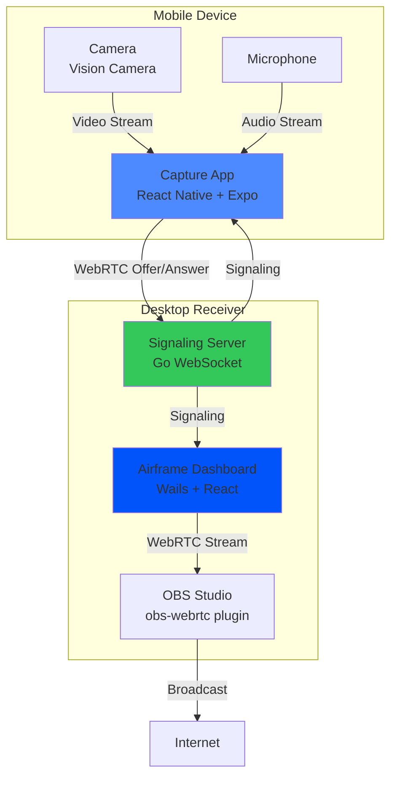

## Component Architecture

### 1. Airframe Dashboard

The desktop receiver application built with Wails (Go backend + React frontend).

#### Technology Stack

- **Backend**: Go 1.22+ with Wails v2
- **Frontend**: React 19.1.0 + TypeScript
- **Styling**: Tailwind CSS v4 with `@tailwindcss/vite`
- **Charts**: Recharts 3.9.2
- **Icons**: Lucide React 1.23.0
- **QR Codes**: qrcode.react 4.2.0

#### Directory Structure

```
airframe-dashboard/
├── frontend/
│   ├── src/
│   │   ├── App.tsx              # Main app with WebRTC logic
│   │   ├── components/
│   │   │   ├── MonitorTab.tsx   # Preview pane with metrics
│   │   │   ├── MetricCard.tsx   # Quality indicator cards
│   │   │   └── StatusPill.tsx   # Connection status badge
│   │   └── index.css            # Tailwind CSS v4 with @theme
│   ├── package.json
│   └── vite.config.ts           # Vite with @tailwindcss/vite
├── main.go                      # Wails entry point
├── signaling.go                 # WebSocket signaling server
└── wails.json                   # Wails configuration
```

#### Dashboard Architecture

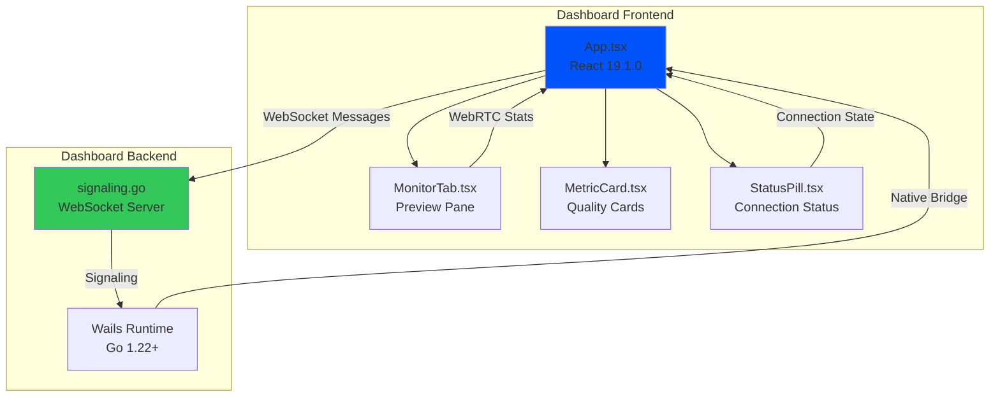

#### WebRTC Flow in Dashboard

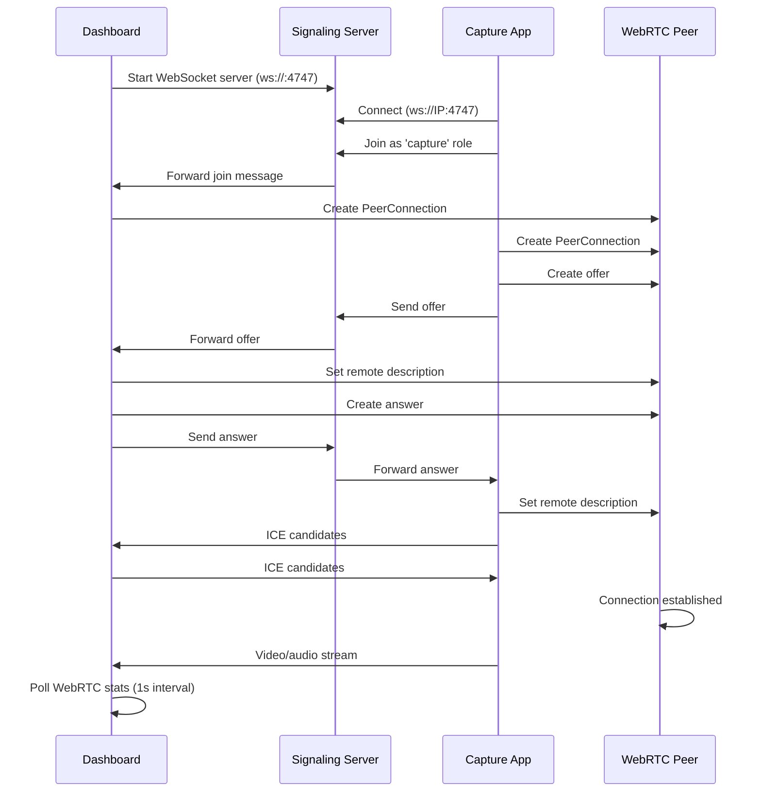

### 2. Capture App

The mobile transmitter application built with React Native + Expo.

#### Technology Stack

- **Framework**: React Native 0.86.0 + Expo ~57.0.4
- **Camera**: react-native-vision-camera 5.1.0
- **WebRTC**: react-native-webrtc 124.0.7
- **Icons**: lucide-react-native 1.23.0
- **Fonts**: Figtree + DM Mono (Google Fonts)
- **Language**: TypeScript 6.0.3

#### Directory Structure

```
capture-app/
├── screens/
│   ├── SplashScreen.tsx      # Brand splash with auto-redirect
│   ├── DiscoverScreen.tsx    # Network discovery and device list
│   ├── PreviewScreen.tsx     # Viewfinder with HUD controls
│   └── SettingsScreen.tsx   # Camera configuration
├── App.tsx                   # Main app with navigation and WebRTC
├── ErrorBoundary.tsx        # Error handling wrapper
├── MOBILE_APP_DESIGN.md      # Complete design specification
└── package.json
```

#### Capture App Architecture

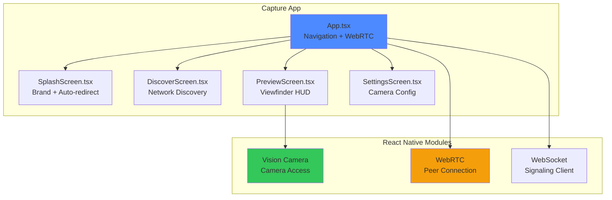

#### Screen Navigation Flow

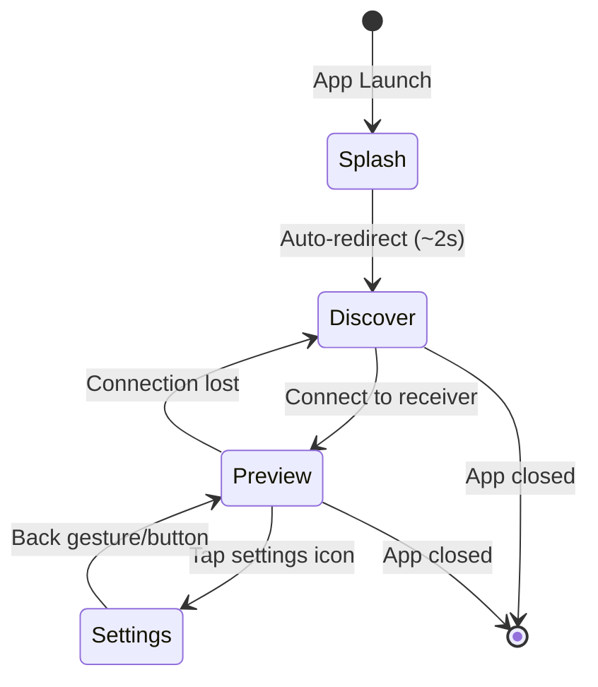

### 3. Signaling Server

The WebSocket signaling server implemented in Go.

#### Technology Stack

- **Language**: Go 1.22+
- **Framework**: Wails v2
- **Protocol**: WebSocket (RFC 6455)
- **Port**: 4747 (default)

#### Signaling Protocol

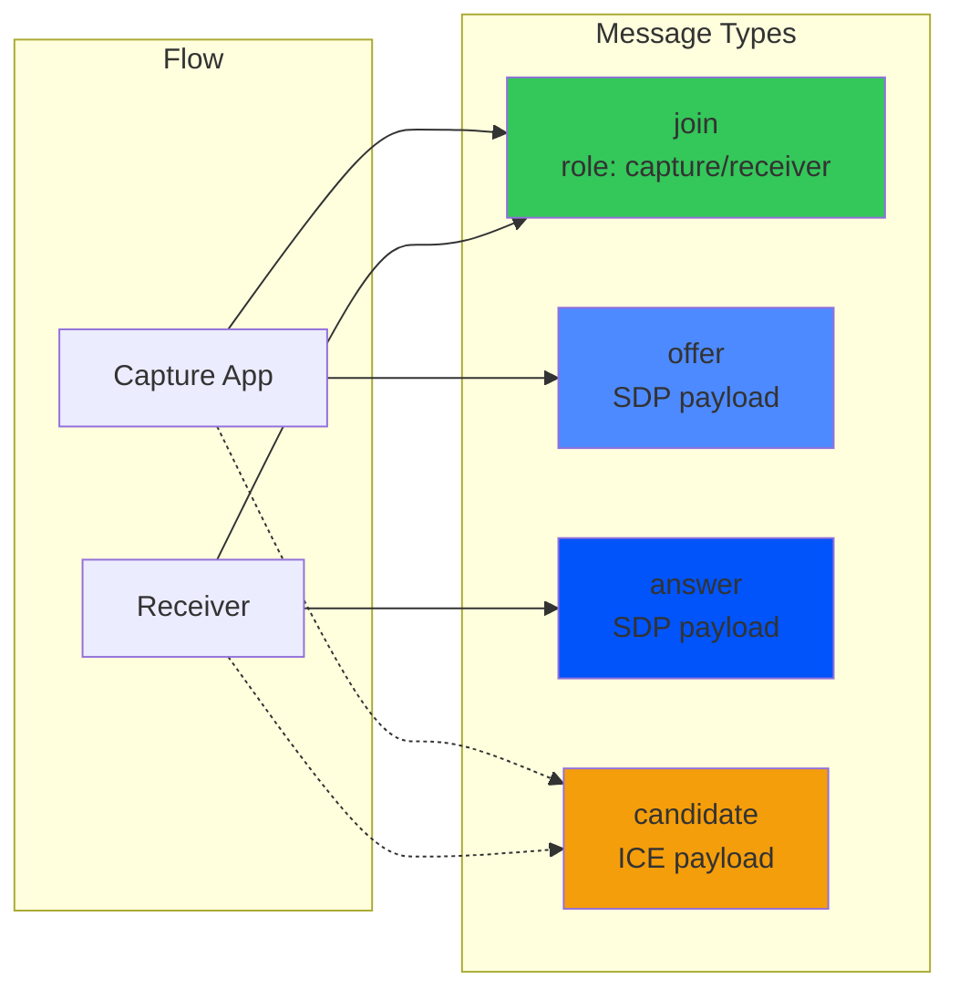

#### Signaling Message Format

```json
{
  "type": "join|offer|answer|candidate",
  "role": "capture|receiver",
  "payload": {
    "type": "offer|answer",
    "sdp": "v=0\r\no=- ...",
    "candidate": "candidate:1 1 UDP ...",
    "sdpMid": "0",
    "sdpMLineIndex": 0
  }
}
```

## Data Flow

### Streaming Pipeline

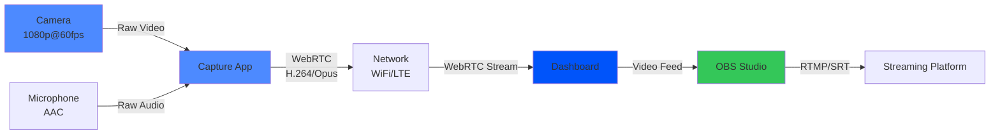

### Metrics Collection

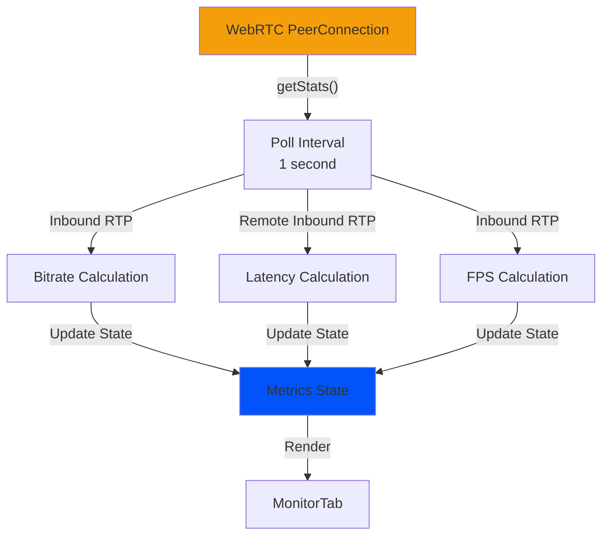

## Network Architecture

### Local Network Setup

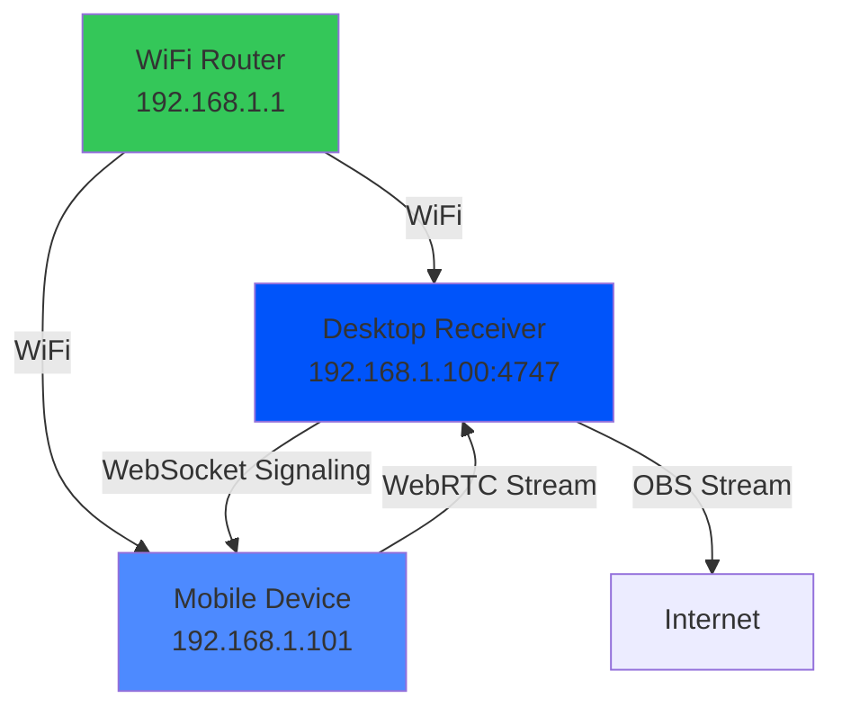

### Port Usage

| Port | Protocol | Usage | Direction |
|------|----------|-------|-----------|
| 4747 | WebSocket | Signaling server | Bi-directional |
| Dynamic | UDP | WebRTC media | Bi-directional |
| Dynamic | TCP | WebRTC data | Bi-directional |

## Design System Integration

### Design Tokens

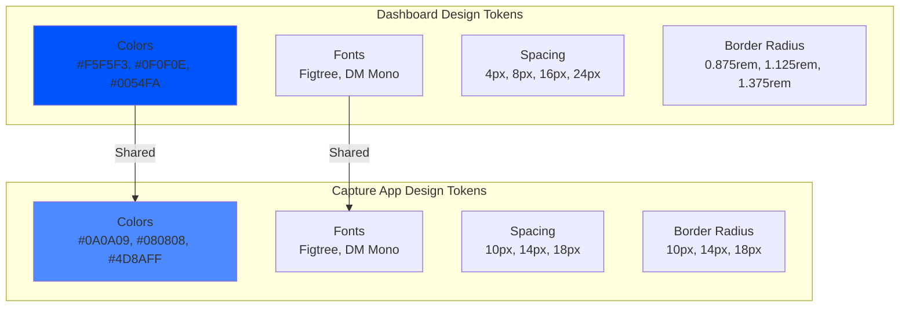

### Typography System

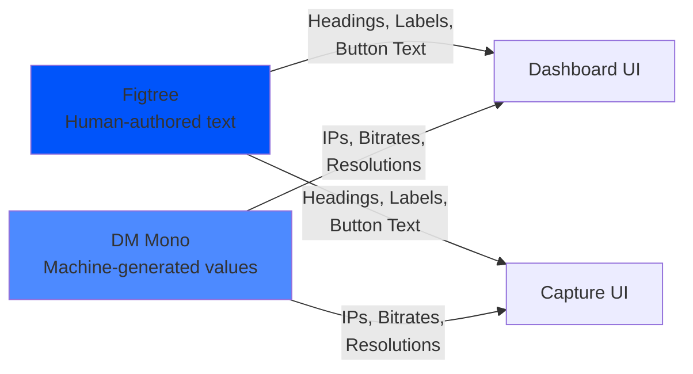

## Error Handling

### Error Boundary Architecture

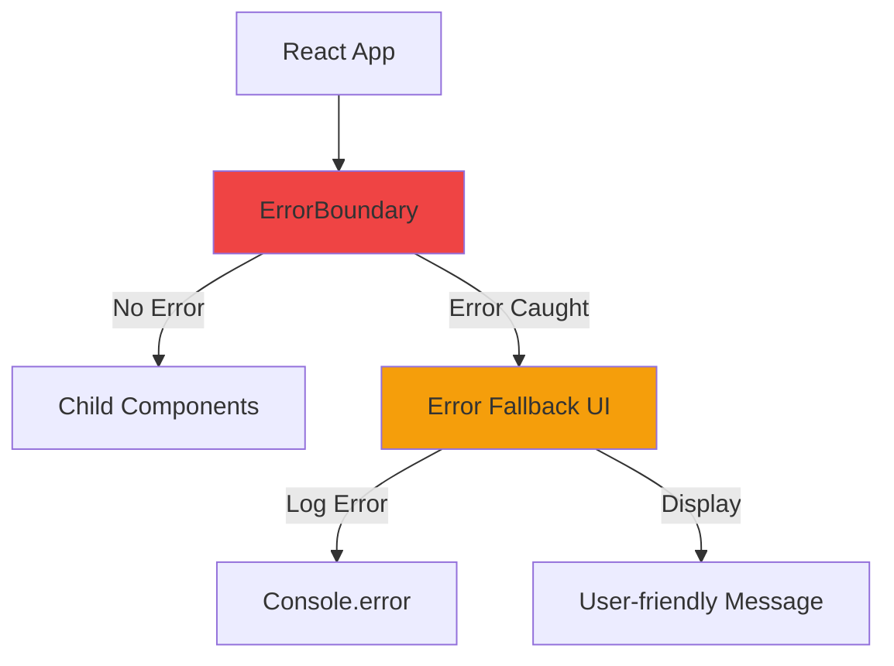

### Connection Error Handling

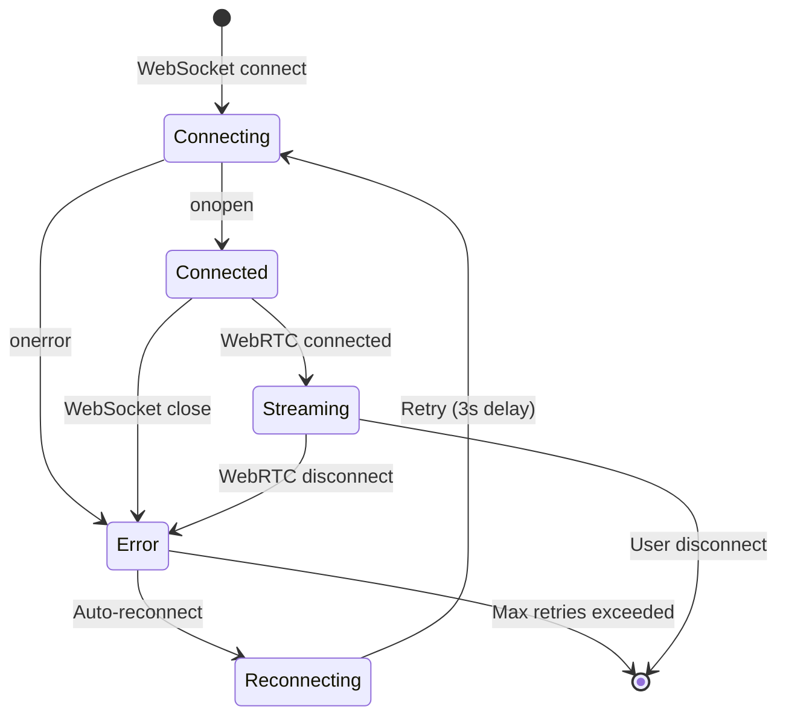

## Performance Considerations

### WebRTC Optimization

- **SDP Bitrate Hack**: Enforce 20 Mbps limit for quality
- **ICE Servers**: Google STUN server for NAT traversal
- **Codec Selection**: H.264 for video, Opus for audio
- **Resolution**: 1920x1080 @ 60fps target
- **Polling Interval**: 1 second for stats collection

### React Performance

- **React 19.1.0**: Latest React with concurrent features
- **Vite**: Fast development server and optimized builds
- **Code Splitting**: Lazy loading for large components
- **Memoization**: React.memo for expensive renders

### Mobile Performance

- **Vision Camera**: Hardware-accelerated camera access
- **Native Modules**: WebRTC and camera use native implementations
- **Optimized Renders**: Functional components with hooks
- **Animation**: Native Animated API for smooth animations

## Security Considerations

### WebSocket Security

- **Local Network Only**: No public internet exposure
- **No Authentication**: Trusted local network environment
- **Role-Based**: Capture/receiver role separation

### WebRTC Security

- **DTLS/SRTP**: Encrypted media transport
- **ICE Candidates**: Controlled candidate exchange
- **STUN Only**: No TURN server (local network only)

## Deployment

### Dashboard Deployment

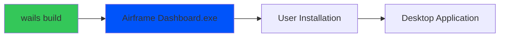

### Capture App Deployment

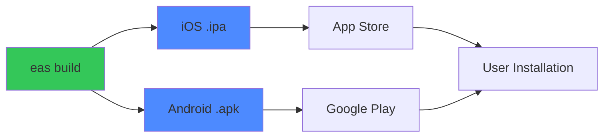

## Future Architecture

### Planned Enhancements

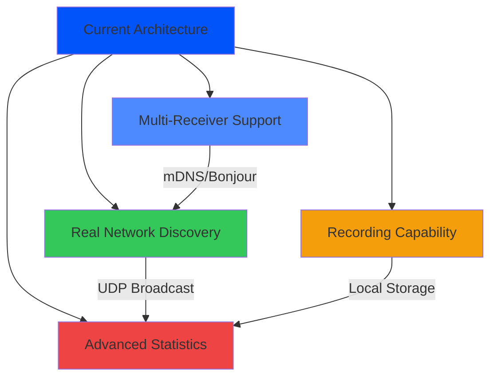

### Scalability Considerations

- **Multi-Receiver**: Support multiple capture apps per receiver
- **Load Balancing**: Distribute streams across multiple receivers
- **Cloud Signaling**: Optional cloud signaling for remote connections
- **Recording**: Local and cloud recording options
- **Analytics**: Stream quality analytics and monitoring

## References

- [Wails Documentation](https://wails.io/docs)
- [React Native Documentation](https://reactnative.dev)
- [WebRTC Specification](https://w3c.github.io/webrtc-pc/)
- [Tailwind CSS v4](https://tailwindcss.com)
- [Expo Documentation](https://docs.expo.dev)

## Web Presence & Documentation Strategy (Stage One)

For post-Stage One distribution and documentation, Airframe will utilize a top-level web presence:

- **Central Hub (`airframe.website`)**: The primary domain for Airframe marketing, downloads, and documentation. Using a dedicated domain rather than subdomains emphasizes the maturity of the ecosystem and acts as the central entry point for new users to discover both the desktop Receiver and mobile Capture apps.
- **Naming Convention**: 
  - Modules are named as parallel peers (e.g., **Airframe Capture**, **Airframe Receiver**) without colons to avoid filesystem restrictions and signal a cohesive product suite rather than a franchise format.
- **Universal Logo**: 
  - A single universal "Airframe" logo (the 3D-extruded dark squircle with the geometric "A") is used across all modules. This unifies the brand identity, relying on platform contexts (desktop vs. mobile) to distinguish the specific module being run.
