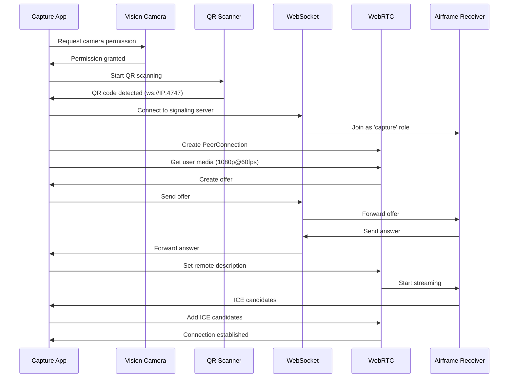

# Airframe Capture App (Old Version)

**This is the original capture app version, preserved for reference. The active version is now in `../capture-app/`**

A React Native + Expo mobile application that captures camera feed and streams it via WebRTC to the Airframe receiver.

## Overview

The original capture app provides a simple QR code scanning interface to pair with the Airframe receiver. Once paired, it streams 1080p @ 60fps video and audio via WebRTC.

## Features

- **QR Code Pairing**: Scan QR codes from the receiver dashboard to connect
- **WebRTC Streaming**: 1920x1080 @ 60fps video with audio
- **Real-time Status**: Connection state and streaming status display
- **Auto-reconnect**: Automatically reconnects if connection is lost
- **Camera Integration**: Uses react-native-vision-camera for camera access

## Tech Stack

- **React Native**: 0.86.0
- **Expo**: ~57.0.2
- **react-native-vision-camera**: ^5.1.0
- **react-native-webrtc**: ^124.0.7
- **TypeScript**: ~6.0.3

## Architecture

### Single-Screen Design

The original app uses a simple single-screen architecture:

```
┌─────────────────────────────────────┐
│         Camera Feed Layer          │
│  (Full-screen camera preview)       │
└─────────────────────────────────────┘
┌─────────────────────────────────────┐
│         UI Overlay Layer           │
│  ┌───────────────────────────────┐ │
│  │ Header (Logo + Live Badge)    │ │
│  └───────────────────────────────┘ │
│  ┌───────────────────────────────┐ │
│  │ Scanner Overlay (QR Box)     │ │
│  └───────────────────────────────┘ │
│  ┌───────────────────────────────┐ │
│  │ Status Card (Connection)     │ │
│  └───────────────────────────────┘ │
└─────────────────────────────────────┘
```

### Connection Flow



## Development

### Prerequisites

- Node.js 18 or higher
- Expo CLI: `npm install -g expo-cli`
- iOS: Xcode 15+ (for iOS development)
- Android: Android Studio with SDK 34+ (for Android development)

### Installation

```bash
cd capture-app-old
npm install
```

### Running the App

```bash
# Start Expo development server
npm start

# Run on iOS
npm run ios

# Run on Android
npm run android
```

### Building for Production

```bash
# Build iOS app
eas build --platform ios

# Build Android app
eas build --platform android
```

## Key Implementation Details

### SDP Bitrate Hack

The app modifies the SDP (Session Description Protocol) to enforce a 20 Mbps bitrate limit:

```typescript
let sdp = offer.sdp;
if (sdp.includes("b=AS:")) {
  sdp = sdp.replace(/b=AS:\d+/g, "b=AS:20000");
} else {
  sdp = sdp.replace(/c=IN IP4 .*\r\n/g, "$&b=AS:20000\r\n");
}
offer.sdp = sdp;
```

This ensures high-quality 1080p streaming by bypassing default WebRTC bitrate limitations.

### Auto-Reconnect Logic

The app automatically reconnects if the WebSocket connection is lost:

```typescript
ws.onclose = () => {
  setStatus('Disconnected. Reconnecting...');
  setPeerConnected(false);
  setTimeout(() => connectSignaling(wsUrl), 3000);
};
```

### Camera Configuration

The camera is configured for optimal streaming quality:

```typescript
const stream = await mediaDevices.getUserMedia({
  video: {
    width: { ideal: 1920 },
    height: { ideal: 1080 },
    frameRate: { ideal: 60 },
    facingMode: "environment"
  },
  audio: true
});
```

## Limitations

- Single-screen design (no dedicated settings screen)
- Basic UI with emoji icons
- No network discovery (requires manual QR scanning)
- Limited error handling
- No proper typography system

## Migration to New Version

The new capture app (`../capture-app/`) addresses these limitations with:
- Multi-screen architecture (Splash, Discover, Preview, Settings)
- Design system adherence with proper typography
- Network discovery capabilities
- Sophisticated viewfinder UI
- Better error handling and state management
