# Airframe — Mobile App: Complete Design Specification

**Version:** 1.0  
**Audience:** Bolt.new recreating this interface from scratch  
**Stack:** React Native + Expo (SDK 51+), TypeScript  
**Target:** iOS & Android

---

## Table of Contents

1. [Design Philosophy](#1-design-philosophy)
2. [Screen Architecture & Navigation Flow](#2-screen-architecture--navigation-flow)
3. [Design Tokens](#3-design-tokens)
4. [Typography](#4-typography)
5. [Screen: Splash](#5-screen-splash)
6. [Screen: Discover](#6-screen-discover)
7. [Screen: Preview](#7-screen-preview)
8. [Screen: Settings](#8-screen-settings)
9. [Shared Primitives](#9-shared-primitives)
10. [Interactive Behaviors & State](#10-interactive-behaviors--state)
11. [Color Usage Rules](#11-color-usage-rules)
12. [Spacing Reference](#12-spacing-reference)
13. [Exact Reproduction Checklist](#13-exact-reproduction-checklist)

---

## 1. Design Philosophy

The Airframe mobile app is a **live production transmitter**, not a media player or social app. The operator is often holding a phone as a camera during a live broadcast. Every screen must work at a glance, with one hand, under pressure.

**Core principles:**

| Principle                  | How it manifests                                                                                                                             |
| -------------------------- | -------------------------------------------------------------------------------------------------------------------------------------------- |
| Dark-only UI               | Every screen uses `#0A0A09` or `#080808` as the base. There is no light mode. The phone is a camera; the display never fights the scene.     |
| Black/white primary        | All structural chrome is white-on-black at reduced opacity. No decorative color anywhere.                                                    |
| Mono for machine values    | Every number the app generates — IP addresses, bitrates, resolutions, fps counts — uses **DM Mono**. Human-authored labels use **Figtree**.  |
| Functional motion only     | The only animations are: the splash ring pulse, the discovery scan ping, the tally dot pulse, and the connecting spinner. Nothing decorates. |
| Camera metaphor throughout | The Preview screen is a viewfinder, not a UI surface. Controls sit at the edges; the image owns the center.                                  |
| Two-channel status         | Connection quality is communicated via color AND a text label. Never color alone.                                                            |

---

## 2. Screen Architecture & Navigation Flow

### The four screens

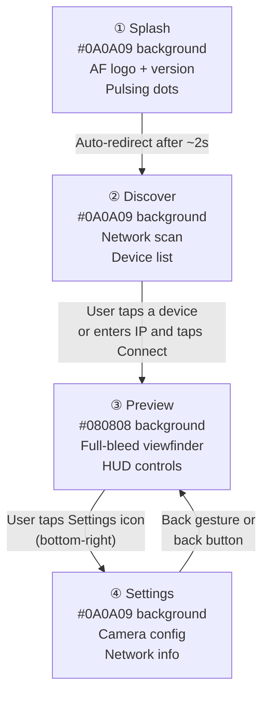

### User journey — prose

1. The app launches. The **Splash** screen appears immediately — no loading spinner, no blank white flash. The brand is present from frame one.
2. After approximately 2 seconds, the app navigates automatically to **Discover**.
3. **Discover** scans the local network and lists found receivers. The user taps a device row to connect, or expands a manual IP entry field and taps Connect.
4. Once connected, the app navigates to **Preview**. This is the primary operational screen. It stays here for the duration of the live session.
5. From **Preview**, tapping the Settings icon (bottom-right corner button) navigates to **Settings**.
6. **Settings** is a simple configuration screen. The user adjusts parameters and navigates back to **Preview** using the OS back gesture or back button.

### Navigation stack model

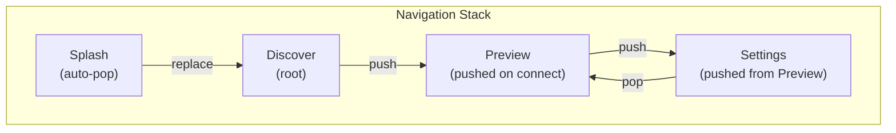

> **Implementation note:** Splash replaces itself — it should not remain in the back stack. Use `navigation.replace('Discover')` or `router.replace('/discover')` depending on your navigation library. The user should never be able to back-navigate to Splash.

### Recommended libraries

| Concern    | Library                                                        |
| ---------- | -------------------------------------------------------------- |
| Navigation | `expo-router` (file-based) or `@react-navigation/native-stack` |
| Animations | React Native's built-in `Animated` API                         |
| Icons      | `lucide-react-native`                                          |
| Fonts      | `expo-font` + Google Fonts (Figtree, DM Mono)                  |

---

## 3. Design Tokens

The entire app is dark-only. There is no theme toggle. All values below are fixed.

### Base surface colors

| Token name        | Value                    | Used for                                                               |
| ----------------- | ------------------------ | ---------------------------------------------------------------------- |
| `surface.base`    | `#0A0A09`                | Page/screen background for Splash, Discover, Settings                  |
| `surface.preview` | `#080808`                | Preview screen background — marginally darker to read as a camera feed |
| `surface.card`    | `rgba(255,255,255,0.05)` | Device cards, settings cards, manual IP panel                          |
| `surface.input`   | `rgba(255,255,255,0.07)` | Text input background                                                  |
| `surface.overlay` | `rgba(0,0,0,0.50)`       | Frosted pills and HUD badges overlaid on the camera feed               |

### Text colors

| Token name       | Value                    | Used for                                             |
| ---------------- | ------------------------ | ---------------------------------------------------- |
| `text.primary`   | `#FFFFFF`                | Main labels, device names, setting titles            |
| `text.secondary` | `rgba(255,255,255,0.45)` | Subtitles, descriptions                              |
| `text.tertiary`  | `rgba(255,255,255,0.30)` | Metadata, app namespace labels                       |
| `text.dim`       | `rgba(255,255,255,0.25)` | Placeholder text, footnotes, icons in resting state  |
| `text.overlay`   | `rgba(255,255,255,0.55)` | Text inside HUD badges sitting on the camera preview |
| `text.mono`      | `rgba(255,255,255,0.35)` | DM Mono secondary values (IPs, port numbers)         |

### Border colors

| Token name          | Value                    | Used for                     |
| ------------------- | ------------------------ | ---------------------------- |
| `border.subtle`     | `rgba(255,255,255,0.07)` | Card and panel borders       |
| `border.input`      | `rgba(255,255,255,0.09)` | Input field border at rest   |
| `border.inputFocus` | `rgba(77,138,255,0.50)`  | Input field border on focus  |
| `border.dashed`     | `rgba(255,255,255,0.13)` | Manual IP row dashed border  |
| `border.hud`        | `rgba(255,255,255,0.09)` | HUD badge borders on Preview |

### Accent & semantic colors

These are **absolute** — they carry fixed meaning and never change with any theme.

| Name               | Value                    | Used for                                                         |
| ------------------ | ------------------------ | ---------------------------------------------------------------- |
| `accent.blue`      | `#4D8AFF`                | Connect button, input focus ring, scan icon, bitrate slider fill |
| `signal.good`      | `#34C759`                | Signal bars when filled, healthy status dot                      |
| `signal.warn`      | `#F59E0B`                | Amber connecting dot                                             |
| `signal.error`     | `#EF4444`                | Error banner, connection refused state                           |
| `signal.errorText` | `#FC8181`                | Error text label (`red-300` equivalent)                          |
| `tally.live`       | `#EF4444`                | Live tally button background, live dot                           |
| `tally.liveText`   | `#FFFFFF`                | Text inside live tally pill                                      |
| `inactive`         | `rgba(255,255,255,0.12)` | Unlit signal bars, inactive control backgrounds                  |

### Border radius

| Name          | Value    | Used for                                    |
| ------------- | -------- | ------------------------------------------- |
| `radius.sm`   | `10px`   | Small chips, badges, rounded-lg equivalent  |
| `radius.md`   | `14px`   | Buttons, input fields (`rounded-xl`)        |
| `radius.lg`   | `18px`   | Cards, device rows (`rounded-2xl`)          |
| `radius.full` | `9999px` | Pills, dots, focus reticle, control buttons |

---

## 4. Typography

**Two fonts. One rule.**

- **Figtree** — everything a human authors: screen headings, setting labels, device names, button text, body copy, descriptions.
- **DM Mono** — everything the app generates: IP addresses, bitrate values, fps counts, resolution strings, port numbers, version strings, all section label headers.

```
Import via expo-font or @expo-google-fonts:
  @expo-google-fonts/figtree
  @expo-google-fonts/dm-mono
```

### Type scale

| Role                                       | Font    | Weight | Size | Opacity                                 |
| ------------------------------------------ | ------- | ------ | ---- | --------------------------------------- |
| Screen heading ("Find Receiver", "Camera") | Figtree | 600    | 22px | 100% white                              |
| App namespace label ("Airframe")           | DM Mono | 400    | 10px | 30% white, `tracking: 0.2em`, uppercase |
| Body / subtitle                            | Figtree | 400    | 14px | 45% white                               |
| Device name                                | Figtree | 500    | 14px | 100% white                              |
| Device IP                                  | DM Mono | 400    | 12px | 35% white                               |
| Section label header                       | DM Mono | 400    | 10px | 30% white, `tracking: 0.2em`, uppercase |
| Setting row label                          | Figtree | 500    | 14px | 100% white                              |
| Setting row sublabel                       | Figtree | 400    | 12px | 35% white                               |
| Segment button (active)                    | Figtree | 500    | 14px | `#0A0A09` (dark text on white fill)     |
| Segment button (inactive)                  | Figtree | 500    | 14px | 50% white                               |
| Bitrate value display                      | DM Mono | 400    | 14px | 100% white                              |
| Bitrate range labels                       | DM Mono | 400    | 10px | 25% white                               |
| Network info key                           | Figtree | 400    | 14px | 55% white                               |
| Network info value                         | DM Mono | 400    | 12px | 35% white                               |
| HUD resolution badge                       | DM Mono | 400    | 12px | 55% white                               |
| Tally label ("LIVE", "STANDBY")            | DM Mono | 500    | 12px | varies by state                         |
| Elapsed timer                              | DM Mono | 400    | 12px | 40% white                               |
| Version string                             | DM Mono | 400    | 10px | 30% white, uppercase, `tracking: 0.2em` |
| Splash wordmark                            | Figtree | 600    | 20px | 100% white                              |
| Error label                                | Figtree | 500    | 12px | `#FC8181` (red-300)                     |
| Error detail                               | DM Mono | 400    | 12px | `rgba(239,68,68,0.60)`                  |

**The letter-spacing rule on section labels:** Every section header label (e.g., `AIRFRAME`, `RESOLUTION`, `BITRATE`, `DISCOVERED`) uses DM Mono + `letterSpacing: 3–4px` (equivalent of `tracking-[0.2em]`) + `textTransform: 'uppercase'`. This creates hierarchy without adding visual weight — the label recedes, letting the content below lead.

**The `fontVariant: ['tabular-nums']` rule:** Any live-updating number that changes width as data flows — elapsed timer, bitrate display — must use tabular (fixed-width) numerals to prevent layout jumping. In React Native this is `fontVariant: ['tabular-nums']` in the style object.

---

## 5. Screen: Splash

### Purpose

Immediate brand presence on app launch. No user interaction required. Auto-navigates to Discover after ~2 seconds.

### Visual layout

```
┌─────────────────────────────────┐
│                                 │
│                                 │
│         ○ ○                     │  ← outer ring: 128px, border-white/[0.045], animate-ping
│       ○     ○                   │
│      ○  ○○   ○                  │  ← inner ring: 88px, border-white/[0.07], static
│       ○ AF ○                    │  ← logo mark: 56px, white bg, rounded-[18px]
│      ○       ○                  │
│       ○     ○                   │
│         ○ ○                     │
│                                 │
│         Airframe                │  ← Figtree 600 20px, white
│          v2.4.0                 │  ← DM Mono 10px, white/30, uppercase, tracked
│                                 │
│                                 │
│           • • •                 │  ← 3 pulsing dots, 5px, white/25, staggered delay
│                                 │
└─────────────────────────────────┘
```

### Component breakdown

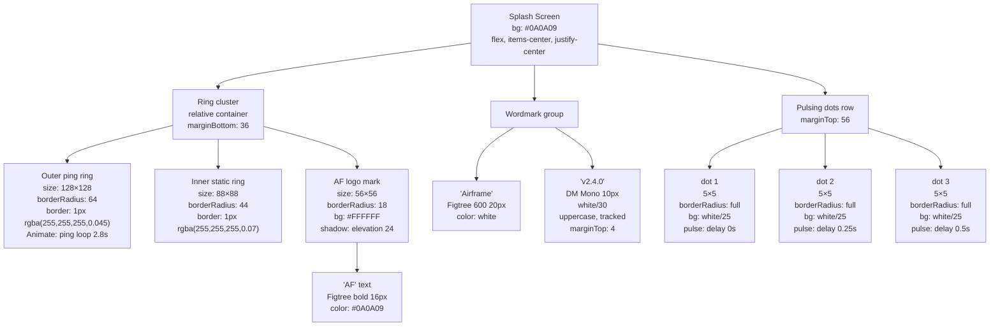

### Ring animation — how it works

The outer ring uses a "ping" animation: it scales up from 1× to ~1.15× while fading from its natural opacity to 0, then repeats. In React Native, implement this with `Animated.loop` + `Animated.parallel` combining `Animated.timing` on both `scale` and `opacity`.

```
Ping animation spec:
  duration: 2800ms
  easing: ease-in-out
  loop: infinite
  start: scale=1.0, opacity=1
  end:   scale=1.15, opacity=0
```

The inner ring is **static** — no animation.

### Pulsing dots — how they work

Three 5×5px circles, spaced `7px` apart in a row. Each pulses (opacity 1 → 0.3 → 1) on a continuous loop. The key is the **staggered delay**: dot 1 starts at 0ms, dot 2 at 250ms, dot 3 at 500ms. This creates a left-to-right wave effect.

```
Dot pulse spec:
  duration: 1000ms (per pulse cycle)
  loop: infinite
  opacity range: 0.25 → 0.65 → 0.25
  delays: [0ms, 250ms, 500ms]
```

### Auto-navigation timing

```
On mount:
  setTimeout(() => navigation.replace('Discover'), 2000)
```

Use `replace` not `navigate` — Splash must not remain in the back stack.

### Exact measurements

| Element                      | Value                                                                   |
| ---------------------------- | ----------------------------------------------------------------------- |
| Screen background            | `#0A0A09`                                                               |
| Outer ring diameter          | 128px                                                                   |
| Outer ring border            | 1px, `rgba(255,255,255,0.045)`                                          |
| Inner ring diameter          | 88px                                                                    |
| Inner ring border            | 1px, `rgba(255,255,255,0.07)`                                           |
| Logo mark size               | 56×56px                                                                 |
| Logo mark border radius      | 18px                                                                    |
| Logo mark background         | `#FFFFFF`                                                               |
| "AF" text                    | Figtree bold 16px, `#0A0A09`                                            |
| "Airframe" text              | Figtree 600 20px, `#FFFFFF`                                             |
| "v2.4.0" text                | DM Mono 10px, `rgba(255,255,255,0.30)`, uppercase, `letterSpacing: 3px` |
| Gap: ring cluster → wordmark | 36px                                                                    |
| Gap: wordmark → dots         | 56px                                                                    |
| Dot size                     | 5×5px                                                                   |
| Dot gap                      | 7px                                                                     |
| Dot color                    | `rgba(255,255,255,0.25)`                                                |

---

## 6. Screen: Discover

### Purpose

The user arrives here automatically after Splash. The app is scanning the local Wi-Fi network for Airframe Receiver instances. Found devices appear as tappable rows. There is also a manual IP entry option.

### Visual layout

```
┌─────────────────────────────────┐
│  status bar area (dark)         │
│                                 │
│  Airframe                       │  ← DM Mono 10px, white/30, uppercase
│  Find Receiver                  │  ← Figtree 600 22px, white
│  Scanning local network         │  ← Figtree 400 14px, white/45
│                                 │
│  [● wifi icon]─────────────5GHz │  ← scan pulse row
│                                 │
│  DISCOVERED                     │  ← DM Mono 10px, white/25, uppercase
│                                 │
│ ┌─────────────────────────────┐ │
│ │ [■] Studio Mac Mini  ||||▶  │ │  ← device row
│ │     192.168.1.42            │ │
│ └─────────────────────────────┘ │
│ ┌─────────────────────────────┐ │
│ │ [■] Edit Suite — Room B  ▶  │ │
│ │     192.168.1.67            │ │
│ └─────────────────────────────┘ │
│                                 │
│ ┌ ─ ─ Enter IP manually    ▼ ─ ┐│  ← dashed border row (collapsed)
│                                 │
│ ┌─────────────────────────────┐ │
│ │ ⚠ Connection refused        │ │  ← error state banner
│ │   192.168.1.99 — port 4747  │ │
│ └─────────────────────────────┘ │
│                                 │
└─────────────────────────────────┘
```

### Component breakdown

```mermaid
graph TD
    Disc["Discover Screen\nbg: #0A0A09\nflex-col, px-20, overflow scroll"]

    Disc --> Header["Header group\npaddingTop: 56 (safe area)\nmarginBottom: 28"]
    Disc --> ScanRow["Scan pulse row\nmarginBottom: 28"]
    Disc --> SectionLabel["'DISCOVERED' label\nmarginBottom: 12"]
    Disc --> DeviceList["Device list\nspace-y: 8px"]
    Disc --> ManualRow["Manual IP row\n(collapsible)"]
    Disc --> ErrorBanner["Error banner\n(shown when connection fails)"]

    Header --> NSLabel["'Airframe'\nDM Mono 10px, white/30\nuppercase, tracked\nmarginBottom: 8"]
    Header --> Title["'Find Receiver'\nFigtree 600 22px, white"]
    Header --> Subtitle["'Scanning local network'\nFigtree 400 14px, white/45\nmarginTop: 4"]

    ScanRow --> PingIcon["Ping icon container\n36×36px, borderRadius full\nborder: #4D8AFF/50\ncontains: Wifi icon 13px #4D8AFF\n+ outer ping ring #4D8AFF/25"]
    ScanRow --> GradientLine["Gradient line\nflex-1, height 1px\nbg: gradient #4D8AFF/35 → #4D8AFF/10 → transparent"]
    ScanRow --> ChannelLabel["'5 GHz · ch.36'\nDM Mono 12px, white/25"]

    DeviceList --> DeviceRow["DeviceRow (×2)\nsee breakdown below"]
    DeviceList --> ManualIPRow["Manual IP toggle row\ndashed border"]
    DeviceList --> ManualIPPanel["Manual IP panel\n(conditional, appears below toggle)"]

    ErrorBanner --> ErrIcon["AlertCircle 14px\ntext-red-400\nalignSelf: flex-start, marginTop: 2"]
    ErrorBanner --> ErrText["'Connection refused'\nFigtree 500 12px, #FC8181"]
    ErrorBanner --> ErrDetail["'192.168.1.99 — port 4747 unreachable'\nFigtree 400 12px, red-400/60"]
```

### DeviceRow — detailed breakdown

Each discovered device renders as a single tappable row card.

```
┌────────────────────────────────────────────────────┐
│  [■]   Studio Mac Mini              | | | | ›       │
│        192.168.1.42                                 │
└────────────────────────────────────────────────────┘
```

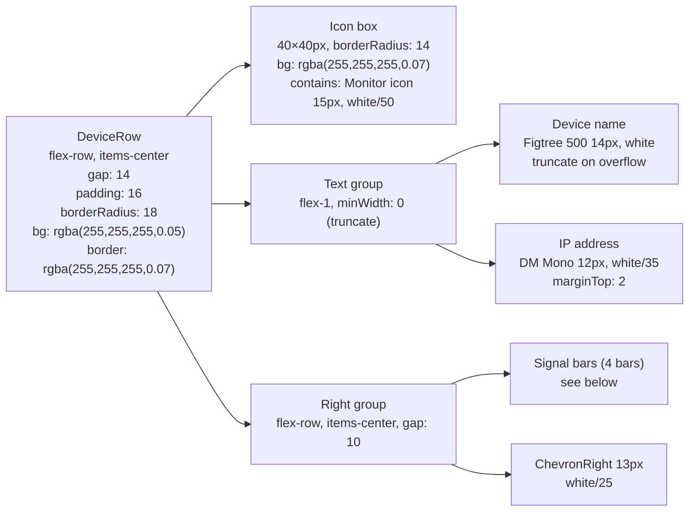

#### Signal bars — exact spec

Four vertical bars sitting side-by-side, aligned to their bottom edges (tallest bar on the right). Each bar is 3px wide with 3px gap between. Heights are proportional: `[35%, 55%, 75%, 100%]` of a 14px container.

A bar is **lit** (`#34C759`) if the device signal percentage exceeds the bar's threshold. It is **dim** (`rgba(255,255,255,0.12)`) otherwise.

```
Threshold mapping:
  Bar 1 (shortest, leftmost): lit if signal > 26
  Bar 2:                       lit if signal > 52
  Bar 3:                       lit if signal > 78
  Bar 4 (tallest, rightmost):  lit if signal > 100  (virtually always dim)

For signal=96 → bars 1, 2, 3 lit; bar 4 dim
For signal=72 → bars 1, 2 lit; bars 3, 4 dim
```

In React Native:

```
barContainer: { flexDirection: 'row', alignItems: 'flex-end', height: 14, gap: 3 }
bar:          { width: 3, borderRadius: 1 }
heights:      [14 * 0.35, 14 * 0.55, 14 * 0.75, 14 * 1.0]  // [4.9, 7.7, 10.5, 14]
```

### Manual IP row — collapsed state

```
┌ ─ ─ ─ ─ ─ ─ ─ ─ ─ ─ ─ ─ ─ ─ ─ ─ ─ ─ ─ ─ ─ ─ ─ ─ ─ ┐
  🌐  Enter IP manually                              ⌄
└ ─ ─ ─ ─ ─ ─ ─ ─ ─ ─ ─ ─ ─ ─ ─ ─ ─ ─ ─ ─ ─ ─ ─ ─ ─ ┘
```

- Container: full-width, `padding: 16`, `borderRadius: 18`, `borderStyle: 'dashed'`, `borderWidth: 1`, `borderColor: rgba(255,255,255,0.13)`
- Globe icon: 14px, `white/35`, `flexShrink: 0`
- Label: "Enter IP manually", Figtree 14px, `white/45`, `flex: 1`
- ChevronDown icon: 13px, `white/25`. Rotates 180° when expanded.
- On hover/press: border brightens to `rgba(255,255,255,0.22)`

### Manual IP panel — expanded state

When the row is tapped, a panel animates open below it (or the row expands — either works).

```
┌─────────────────────────────────┐
│  [192.168.1.xxx____________]    │  ← text input
│  [        Connect         ]     │  ← blue button
└─────────────────────────────────┘
```

- Panel container: `padding: 16`, `borderRadius: 18`, `bg: rgba(255,255,255,0.05)`, `border: rgba(255,255,255,0.07)`, `gap: 12`
- Input: full-width, `bg: rgba(255,255,255,0.07)`, `border: rgba(255,255,255,0.09)`, `borderRadius: 14`, `paddingHorizontal: 16`, `paddingVertical: 10`, `fontSize: 14`, `color: white`, `placeholderTextColor: rgba(255,255,255,0.20)`, `fontFamily: DM Mono`
- Input focus: border changes to `rgba(77,138,255,0.50)`
- Connect button: full-width, `paddingVertical: 10`, `borderRadius: 14`, `bg: #4D8AFF`, `color: white`, Figtree 500 14px

### Error banner

Shown below the device list when a connection attempt fails.

```
┌──────────────────────────────────────────────────────┐
│  ⚠  Connection refused                               │
│     192.168.1.99 — port 4747 unreachable             │
└──────────────────────────────────────────────────────┘
```

- Container: `flexDirection: 'row'`, `gap: 12`, `paddingHorizontal: 16`, `paddingVertical: 12`, `borderRadius: 14`, `bg: rgba(239,68,68,0.08)`, `border: rgba(239,68,68,0.15)`, `borderWidth: 1`
- AlertCircle icon: 14px, `#F87171` (red-400), `alignSelf: 'flex-start'`, `marginTop: 2`
- Text column:
  - "Connection refused": Figtree 500 12px, `#FC8181`
  - IP + detail: Figtree 400 12px, `rgba(239,68,68,0.60)`, `marginTop: 2`

### Scan pulse row — detailed spec

```
[● wifi]──────────────────── 5 GHz · ch.36
```

- Container: `flexDirection: 'row'`, `alignItems: 'center'`, `gap: 12`
- **Ping icon container:** `position: 'relative'`, 36×36px
  - Outer ping ring: `position: 'absolute'`, `inset: 0`, `borderRadius: 18`, `borderWidth: 1`, `borderColor: rgba(77,138,255,0.25)`. Animate: ping loop, 2000ms, infinite.
  - Inner static ring: `position: 'absolute'`, `inset: 0`, `borderRadius: 18`, `borderWidth: 1`, `borderColor: rgba(77,138,255,0.50)`, `justifyContent: 'center'`, `alignItems: 'center'`
  - Wifi icon: 13px, `#4D8AFF`
- Gradient line: `flex: 1`, `height: 1`. In React Native use `LinearGradient` (from `expo-linear-gradient`) going left-to-right: `rgba(77,138,255,0.35)` → `rgba(77,138,255,0.10)` → `transparent`
- Channel label: "5 GHz · ch.36", DM Mono 12px, `white/25`

---

## 7. Screen: Preview

### Purpose

The primary operational screen. A full-bleed camera viewfinder with a minimal HUD. The user taps the large center button to go live. The entire screen is the camera feed — controls sit at the edges and do not intrude on the image.

### Visual layout

```
┌─────────────────────────────────┐  ← #080808 background, fills safe area
│                                 │
│  [● LIVE]   [1080·60fps] [🎤]   │  ← top HUD bar, absolutely positioned
│                                 │
│  ┌ ─ ─ ─ ─ ─ ─ ─ ─ ─ ─ ─ ─ ┐  │
│    ·             ·            │  │  ← rule-of-thirds intersection marks
│  │                            │  │
│  │                            │  │
│    ·             ·            │  │
│  └ ─ ─ ─ ─ ─ ─ ─ ─ ─ ─ ─ ─ ┘  │
│                                 │
│              ( ○ )              │  ← center focus reticle + center dot
│               ·                 │
│                                 │
│                              ⚡ │  ← exposure gauge (right edge)
│                                 │
│                                 │
│  [↔]        [◉ / ■]     [⚙]   │  ← bottom controls
│              00:00:00           │  ← elapsed timer (live only)
│  ─────────────────────────────  │  ← home indicator area
└─────────────────────────────────┘
```

### Layer stack — how the Preview screen is built

The Preview screen is a `position: 'relative'` container filling the full screen. Everything inside is `position: 'absolute'`. There are 7 layers stacked front to back:

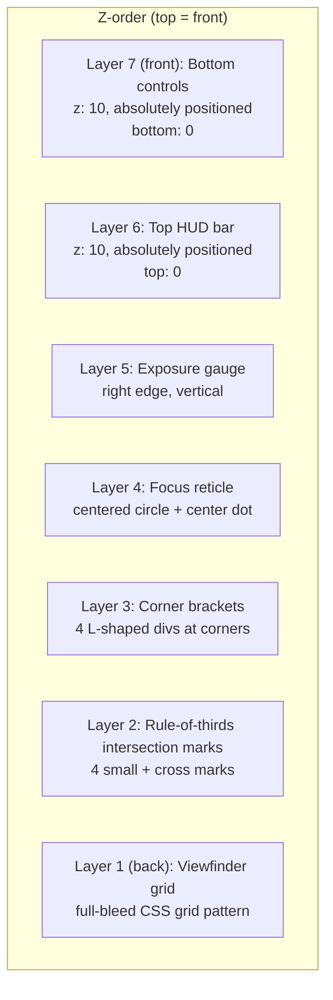

### Layer 1: Viewfinder grid

A 3×3 rule-of-thirds grid that fills the entire screen.

In React Native, replicate with a `View` sized `position: 'absolute', top: 0, left: 0, right: 0, bottom: 0` and render the grid as thin `View` lines:

- 2 horizontal lines at `33.33%` and `66.67%` of screen height
- 2 vertical lines at `33.33%` and `66.67%` of screen width
- Each line: `backgroundColor: rgba(255,255,255,1)`, `opacity: 0.032`, `width: 1px` (vertical) or `height: 1px` (horizontal)

> There is no SVG or image — pure `View` layout. This is important: a CSS background-image approach from the web equivalent does not translate to React Native.

### Layer 2: Rule-of-thirds intersection marks

At each of the 4 intersections of the grid lines (the ± cross marks at 1/3 and 2/3 positions), a small plus-sign marker is drawn. These are NOT the corner brackets — they are the four interior intersection points.

Each intersection mark is a 12×12px container with:

- A horizontal bar: `position: 'absolute'`, `top: 0`, `left: 4` (skipping 4px at each end), `right: 4`, `height: 1`, `backgroundColor: rgba(255,255,255,0.18)`
- A bottom horizontal bar: same, at `bottom: 0`
- A left vertical bar: `position: 'absolute'`, `left: 0`, `top: 4`, `bottom: 4`, `width: 1`, `backgroundColor: rgba(255,255,255,0.18)`
- A right vertical bar: same, at `right: 0`

Positioning: centered at each intersection using `position: 'absolute'`, `left: '33.33%'` etc. with `transform: [{translateX: -6}, {translateY: -6}]`.

```
Intersection positions:
  [33.33%, 33.33%]  [66.67%, 33.33%]
  [33.33%, 66.67%]  [66.67%, 66.67%]
```

### Layer 3: Corner brackets

Four L-shaped brackets at the four corners of the screen, suggesting a camera crop frame. Each bracket is 18×18px. Bottom brackets sit 72px from the bottom to leave room for the bottom controls.

```
Top-left:     top: 20, left: 16     borders: top + left
Top-right:    top: 20, right: 16    borders: top + right
Bottom-left:  bottom: 72, left: 16  borders: bottom + left
Bottom-right: bottom: 72, right: 16 borders: bottom + right
```

- Size: 18×18px
- Border: `borderWidth: 1` (only the two relevant sides), `borderColor: rgba(255,255,255,0.25)`
- In React Native, implement as `borderTopWidth` + `borderLeftWidth` etc. — only set the two sides that form the L.

### Layer 4: Focus reticle

A centered circle with a small dot in the exact center of the screen.

```
Outer circle:
  size: 68×68px
  borderRadius: 34
  borderWidth: 1
  borderColor: rgba(255,255,255,0.12)
  position: absolute, centered via
    top: 50%, left: 50%
    transform: [{translateX: -34}, {translateY: -34}]
  pointerEvents: 'none'

Center dot:
  size: 4×4px
  borderRadius: 2
  backgroundColor: rgba(255,255,255,0.30)
  position: absolute, centered
```

### Layer 5: Exposure gauge

A vertical exposure indicator on the right edge of the screen.

```
Container:
  position: absolute
  right: 14
  top: 50%
  transform: [{translateY: -60}]
  alignItems: center
  gap: 4
  opacity: 0.35

Contents:
  Zap icon (9px, white)
  Vertical line: width 1, height 80, backgroundColor: rgba(255,255,255,0.20)
    Child: exposure marker at 1/3 from top
           position: absolute, top: 26 (≈1/3 of 80)
           left: -5, width: 12, height: 1
           backgroundColor: rgba(255,255,255,0.60)
```

### Layer 6: Top HUD bar

Absolutely positioned at the top of the screen. Contains three elements: the tally/status pill (left), the resolution+fps badge (center-right), and the microphone button (far right).

```
┌─────────────────────────────────────────────────────┐
│  paddingHorizontal: 16, paddingTop: 16              │
│  flexDirection: row, alignItems: flex-start         │
│  justifyContent: space-between                      │
│  position: absolute, top: 0, left: 0, right: 0      │
│  zIndex: 10                                         │
└─────────────────────────────────────────────────────┘
```

#### Tally pill

The tally pill has two states: **STANDBY** and **LIVE**.

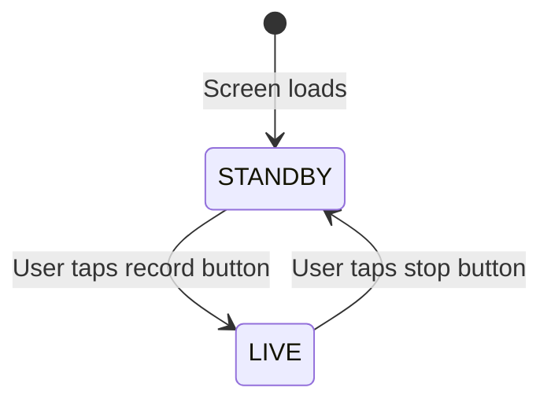

**STANDBY state:**

```
bg: rgba(0,0,0,0.50)
borderWidth: 1, borderColor: rgba(255,255,255,0.09)
backdropBlur (iOS): blurRadius: 10
paddingHorizontal: 10, paddingVertical: 4
borderRadius: 9999
flexDirection: row, alignItems: center, gap: 6

Dot: 6×6px, borderRadius: 3, backgroundColor: rgba(255,255,255,0.40)
Label: "STANDBY", DM Mono 500 12px, rgba(255,255,255,0.60)
```

**LIVE state:**

```
bg: #EF4444
shadow: iOS shadowColor '#EF4444', shadowOpacity 0.30, shadowRadius 8
paddingHorizontal: 10, paddingVertical: 4
borderRadius: 9999
flexDirection: row, alignItems: center, gap: 6

Dot: 6×6px, borderRadius: 3, backgroundColor: #FFFFFF, animate-pulse
Label: "LIVE", DM Mono 500 12px, #FFFFFF
```

The transition between states should be instant (no cross-fade) — in live production, the state change must be unambiguous.

#### Resolution + fps badge

```
bg: rgba(0,0,0,0.50)
borderWidth: 1, borderColor: rgba(255,255,255,0.09)
backdropBlur (iOS): blurRadius: 10
paddingHorizontal: 10, paddingVertical: 4
borderRadius: 10

Text: "1080 · 60 fps"
Font: DM Mono 12px, rgba(255,255,255,0.55)
```

#### Microphone button

```
size: 32×32px
borderRadius: 16
bg: rgba(0,0,0,0.50)
borderWidth: 1, borderColor: rgba(255,255,255,0.09)
backdropBlur: blurRadius 10
justifyContent: center, alignItems: center

Icon (unmuted): Mic 12px, rgba(255,255,255,0.55)
Icon (muted):   MicOff 12px, #F87171 (red-400)
```

The right group (resolution badge + mic button) uses `flexDirection: 'row'`, `alignItems: 'center'`, `gap: 8`.

### Layer 7: Bottom controls

Absolutely positioned at the bottom. Contains the gradient overlay, the three buttons, and the elapsed timer.

```
position: absolute, bottom: 0, left: 0, right: 0
paddingHorizontal: 20
paddingBottom: 28
paddingTop: 64
background: LinearGradient
  direction: top-to-bottom
  colors: [transparent, rgba(0,0,0,0.15), rgba(0,0,0,0.65)]
zIndex: 10
```

The gradient is critical — it ensures the white buttons read over any camera content.

#### The three buttons

```
flexDirection: row
alignItems: center
justifyContent: space-between
```

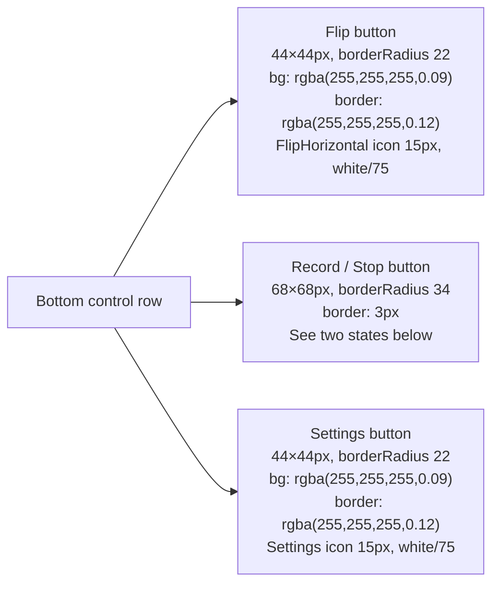

**Record button — STANDBY state:**

```
size: 68×68px, borderRadius: 34
borderWidth: 3, borderColor: rgba(255,255,255,0.30)
backgroundColor: rgba(255,255,255,0.07)
justifyContent: center, alignItems: center

Icon: Circle (filled) 24px, rgba(255,255,255,0.80)
```

**Record button — LIVE state:**

```
size: 68×68px, borderRadius: 34
borderWidth: 3, borderColor: rgba(248,113,113,0.80)  (red-400/80)
backgroundColor: rgba(239,68,68,0.20)
shadow: shadowColor '#EF4444', shadowOpacity 0.20, shadowRadius 12
justifyContent: center, alignItems: center

Icon: Square (filled) 20px, #F87171 (red-400)
```

Transition between states: `duration: 300ms`, ease.

#### Elapsed timer (live only)

Appears below the button row only when `isLive === true`.

```
marginTop: 12
textAlign: center
Font: DM Mono 12px, rgba(255,255,255,0.40)
fontVariant: ['tabular-nums']
Format: HH:MM:SS  e.g. "00:01:43 · 8.4 Mbps"
```

The timer increments every 1000ms via `setInterval`. The bitrate value (`8.4 Mbps`) is a static display value in this implementation.

---

## 8. Screen: Settings

### Purpose

Camera configuration screen. Reached by tapping the Settings icon in Preview. The user adjusts resolution, frame rate, bitrate, audio, and auto-reconnect settings. Network details are shown read-only at the bottom.

### Visual layout

```
┌─────────────────────────────────┐
│  status bar area                │
│                                 │
│  Airframe                       │  ← DM Mono 10px, white/30, uppercase
│  Camera                         │  ← Figtree 600 22px, white
│                                 │
│  RESOLUTION                     │  ← section label
│  [  4K  ] [ 1080p ] [  720p ]   │  ← segment buttons
│                                 │
│  FRAME RATE                     │
│  [ 60 fps ] [ 30 fps ] [ 24 fps]│
│                                 │
│  BITRATE                 8 Mbps │
│  ───────────●────────────────   │  ← slider
│  2 Mbps                  20 Mbps│
│                                 │
│  Include Audio          [toggle]│
│  Stream device microphone       │
│  ────────────────────────────── │
│  Auto-Reconnect         [toggle]│
│  Retry on connection loss       │
│                                 │
│ ┌──────────────────────────────┐│
│ │  Port            4747        ││  ← network info table
│ │  Timeout         10 s        ││
│ │  Protocol        TCP / UDP   ││
│ │  Auth            None        ││
│ └──────────────────────────────┘│
│                                 │
└─────────────────────────────────┘
```

### Component breakdown

```mermaid
graph TD
    Sett["Settings Screen\nbg: #0A0A09\nScrollView\npx: 20, pt: 56, pb: 40"]

    Sett --> Header["Header group\nmarginBottom: 28"]
    Sett --> ResSection["Resolution section\nmarginBottom: 28"]
    Sett --> FpsSection["Frame Rate section\nmarginBottom: 28"]
    Sett --> BitrateSection["Bitrate section\nmarginBottom: 28"]
    Sett --> TogglesSection["Toggles section\ndivide-y"]
    Sett --> NetworkSection["Network info table\nborderRadius: 18"]

    Header --> NSLabel2["'Airframe'\nDM Mono 10px, white/30"]
    Header --> H1["'Camera'\nFigtree 600 22px, white"]

    ResSection --> ResLabel["'RESOLUTION'\nsection label"]
    ResSection --> ResButtons["Segment button group\n['4K', '1080p', '720p']"]

    FpsSection --> FpsLabel["'FRAME RATE'\nsection label"]
    FpsSection --> FpsButtons["Segment button group\n['60', '30', '24'] + ' fps' suffix"]

    BitrateSection --> BitrateHeader["Row: 'BITRATE' label + current value"]
    BitrateSection --> BitrateSlider["Range slider\nmin: 2, max: 20, step: 1"]
    BitrateSection --> BitrateRange["Row: '2 Mbps' + '20 Mbps' at ends"]

    TogglesSection --> AudioToggle["Toggle row: Include Audio"]
    TogglesSection --> ReconnToggle["Toggle row: Auto-Reconnect"]

    NetworkSection --> NetRow1["Port → 4747"]
    NetworkSection --> NetRow2["Timeout → 10 s"]
    NetworkSection --> NetRow3["Protocol → TCP / UDP"]
    NetworkSection --> NetRow4["Auth → None"]
```

### Section label pattern

Every major section uses the same label style:

```
Font: DM Mono 10px
Color: rgba(255,255,255,0.30)
textTransform: 'uppercase'
letterSpacing: 3 (approx 0.2em at 10px)
marginBottom: 12
```

### Segment buttons (Resolution & Frame Rate)

Three equal-width buttons in a row.

```
Container: flexDirection: 'row', gap: 8

Each button:
  flex: 1
  paddingVertical: 10
  borderRadius: 14
  alignItems: center
  justifyContent: center

  ACTIVE state:
    backgroundColor: '#FFFFFF'
    Text: Figtree 500 14px, '#0A0A09' (dark text on white bg)

  INACTIVE state:
    backgroundColor: rgba(255,255,255,0.06)
    borderWidth: 1, borderColor: rgba(255,255,255,0.08)
    Text: Figtree 500 14px, rgba(255,255,255,0.50)
```

**Active selection is white fill with dark text** — maximally legible, not blue. This is intentional. Accent blue is reserved for connection-related UI (scan, connect button, input focus).

### Bitrate slider

```
Header row:
  flexDirection: row, justifyContent: space-between, marginBottom: 12

  Left: 'BITRATE' section label (same style as above)
  Right: '{value} Mbps' — DM Mono 14px, white

Slider:
  width: 100%
  height (track): 3px
  accentColor / tint: '#4D8AFF'
  Track fill visual: LinearGradient overlay
    left side of current value: #4D8AFF
    right side: rgba(255,255,255,0.12)

Range labels row:
  flexDirection: row, justifyContent: space-between, marginTop: 6
  '2 Mbps' — DM Mono 10px, white/25
  '20 Mbps' — DM Mono 10px, white/25
```

> In React Native, use `@react-native-community/slider` or Expo's built-in slider. Set `minimumTrackTintColor="#4D8AFF"` and `maximumTrackTintColor="rgba(255,255,255,0.12)"` — this is the correct RN equivalent of the web CSS gradient trick.

### Toggle rows

Two rows separated by a thin divider line. Each row is identical in structure.

```
Row container:
  flexDirection: row
  alignItems: center
  justifyContent: space-between
  paddingVertical: 16

Text column (left):
  flex-1
  Label: Figtree 500 14px, white
  Sublabel: Figtree 400 12px, white/35, marginTop: 2

Toggle (right):
  see Toggle component spec below
```

The divider between the two rows: `borderTopWidth: 1`, `borderColor: rgba(255,255,255,0.06)`.

#### Toggle component spec

The Toggle is a custom switch — **do not use React Native's built-in Switch**, as it has different visual defaults per platform.

```
Container button:
  width: 40, height: 24
  borderRadius: 12
  backgroundColor: ON → '#4D8AFF' (accent blue), OFF → rgba(255,255,255,0.12)
  Animate: backgroundColor transition 200ms

Thumb:
  position: absolute
  size: 20×20px, borderRadius: 10
  backgroundColor: '#FFFFFF'
  top: 2
  Animate: translateX transition 200ms
    OFF position: translateX(2)   ← 2px from left
    ON position:  translateX(18)  ← 2px from right (40 - 20 - 2 = 18)
  elevation/shadow: Android elevation 2, iOS shadowOpacity 0.15
```

### Network info table

A read-only list of network configuration values. No borders between rows — subtle dividers separate them.

```
Container:
  borderRadius: 18
  backgroundColor: rgba(255,255,255,0.04)
  borderWidth: 1, borderColor: rgba(255,255,255,0.06)
  overflow: hidden

Each row:
  flexDirection: row
  alignItems: center
  justifyContent: space-between
  paddingHorizontal: 16, paddingVertical: 12
  borderBottomWidth: 1 (except last row)
  borderColor: rgba(255,255,255,0.05)

  Key:   Figtree 400 14px, rgba(255,255,255,0.55)
  Value: DM Mono 12px, rgba(255,255,255,0.35)
```

**Data rows:**

| Key      | Value     |
| -------- | --------- |
| Port     | 4747      |
| Timeout  | 10 s      |
| Protocol | TCP / UDP |
| Auth     | None      |

---

## 9. Shared Primitives

### Toggle component

Described in full in §8. Reused in both the Settings screen (Include Audio, Auto-Reconnect) and any future screen that requires a binary on/off control.

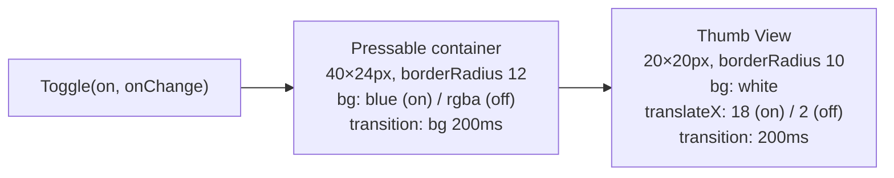

### Section label

Used on Discover (above the device list) and on Settings (before each control group).

```
DM Mono, 10px, rgba(255,255,255,0.25–0.30)
textTransform: 'uppercase'
letterSpacing: 3px
```

The opacity difference: `0.25` on Discover (slightly dimmer — it's a structural label on a scan screen), `0.30` on Settings.

### Frosted HUD badge

Used in Preview for the resolution badge and mic button background.

```
backgroundColor: rgba(0,0,0,0.50)
borderWidth: 1, borderColor: rgba(255,255,255,0.09)
iOS: blurRadius via expo-blur <BlurView intensity={40} tint="dark">
     or simply rely on the 50% black background on Android
```

---

## 10. Interactive Behaviors & State

### State management overview

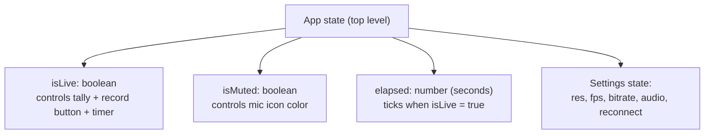

### isLive — live session state

`isLive` is the most important state in the app. It controls:

1. The tally pill: STANDBY → LIVE (color, text, dot animation change)
2. The record button: white circle → red square
3. The elapsed timer: hidden → visible, incrementing
4. The record button border and shadow: neutral → red glow

```
Toggle: user taps the record button
  isLive = false → setIsLive(true)
  isLive = true  → setIsLive(false), setElapsed(0)
```

### Elapsed timer

```tsx
useEffect(() => {
  if (!isLive) {
    setElapsed(0);
    return;
  }
  const id = setInterval(() => setElapsed((s) => s + 1), 1000);
  return () => clearInterval(id);
}, [isLive]);
```

Format function:

```tsx
function fmtTime(s: number): string {
  return [Math.floor(s / 3600), Math.floor((s % 3600) / 60), s % 60]
    .map((n) => String(n).padStart(2, "0"))
    .join(":");
}
// fmtTime(0)    → "00:00:00"
// fmtTime(63)   → "00:01:03"
// fmtTime(3661) → "01:01:01"
```

### Microphone toggle

`isMuted` is local to the Preview screen. Tapping the mic button flips it. When muted, the icon changes from `Mic` to `MicOff` and the icon color changes from `rgba(255,255,255,0.55)` to `#F87171`.

### Navigation from Preview to Settings

The Settings icon (bottom-right button in Preview) triggers navigation to Settings. Depending on your navigation library:

```tsx
// expo-router:
router.push("/settings");

// react-navigation:
navigation.push("Settings");
```

The back gesture on Settings returns to Preview. No state is lost — the live session continues in the background (or pauses, depending on app implementation).

### Manual IP expand/collapse

`manual` is a `boolean` state local to the Discover screen. Tapping the dashed row toggles it. The ChevronDown icon rotates 180° when `manual === true`.

Animate the expand with `LayoutAnimation.configureNext(LayoutAnimation.Presets.easeInEaseOut)` before `setManual(!manual)` in React Native — this gives a smooth expand/collapse without writing explicit animation code.

---

## 11. Color Usage Rules

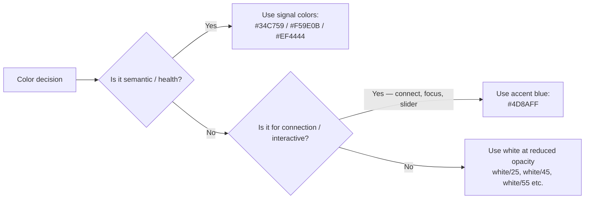

**Accent blue (`#4D8AFF`) appears ONLY on:**

- Scan pulse icon and ring (Discover)
- Connect button (Discover manual IP panel)
- Input focus border (Discover manual IP input)
- Bitrate slider fill / `minimumTrackTintColor` (Settings)
- Toggle thumb track when `on` (Settings)

**Signal colors appear ONLY on:**

- Lit signal bars in device rows (`#34C759`)
- Tally pill background and dot when LIVE (`#EF4444`)
- Record button border and icon when LIVE (`#F87171`)
- Error banner background, border, and text

**White-at-opacity (`rgba(255,255,255,X)`) is used for everything else:**

- All text (primary = 100%, secondary = 45%, tertiary = 30%)
- All card backgrounds (0.05)
- All border hairlines (0.07–0.09)
- All HUD overlays (0.50 black, not white)
- Icon resting states (0.50–0.75)

**Never use:**

- Pure `#FFFFFF` for text (always reduced opacity, except headings and device names)
- A third font (only Figtree and DM Mono exist in this app)
- Any blue for non-connection UI (not on headings, not on icons, not on labels)

---

## 12. Spacing Reference

All spacing uses React Native's default unitless pixel system (1pt = 1dp).

| Value | Used for                                                                    |
| ----- | --------------------------------------------------------------------------- |
| `4`   | Icon-to-text in tight rows                                                  |
| `6`   | Tally dot to text, button icon to label                                     |
| `7`   | Between pulsing dots on Splash                                              |
| `8`   | Between segment buttons, between device cards                               |
| `10`  | `paddingVertical` on segment buttons, manual IP input                       |
| `12`  | Gap between section label and first element; gap in scan row                |
| `14`  | Gap between device icon and text in device rows                             |
| `16`  | `paddingHorizontal` on all screens; `paddingVertical` on toggle rows        |
| `20`  | Screen `paddingHorizontal`, bottom controls padding                         |
| `28`  | Margin between header and first section; `paddingBottom` on screens         |
| `36`  | Gap: splash ring cluster to wordmark                                        |
| `56`  | Gap: splash wordmark to dots; `paddingTop` on settings/discover (safe area) |

---

## 13. Exact Reproduction Checklist

Use this to verify each screen matches the design before shipping.

### Splash

- [ ] Background is `#0A0A09` — not pure black, not dark gray
- [ ] Outer ring: 128px, 1px border, `rgba(255,255,255,0.045)`, ping loop 2.8s
- [ ] Inner ring: 88px, 1px border, `rgba(255,255,255,0.07)`, **static** (no animation)
- [ ] Logo mark: 56×56px, `borderRadius: 18`, white background, "AF" in `#0A0A09` Figtree bold
- [ ] "Airframe": Figtree 600 20px, white
- [ ] "v2.4.0": DM Mono 10px, `rgba(255,255,255,0.30)`, uppercase, tracked
- [ ] 3 pulsing dots: 5px, `rgba(255,255,255,0.25)`, staggered 0/250/500ms delays
- [ ] Auto-navigates via `replace` (not `push`) to Discover after ~2s

### Discover

- [ ] Background is `#0A0A09`
- [ ] "Airframe" namespace label: DM Mono 10px, white/30, uppercase, tracked
- [ ] "Find Receiver" heading: Figtree 600 22px, white
- [ ] Subtitle "Scanning local network": Figtree 400 14px, white/45
- [ ] Scan pulse row: ping animation on outer ring, `#4D8AFF` icon, gradient line to the right
- [ ] "DISCOVERED" section label: DM Mono 10px, white/25
- [ ] Device rows: `borderRadius: 18`, `bg: rgba(255,255,255,0.05)`, `border: rgba(255,255,255,0.07)`
- [ ] Device icon box: 40×40, `borderRadius: 14`, `bg: rgba(255,255,255,0.07)`, Monitor icon 15px white/50
- [ ] Device name: Figtree 500 14px, truncated on overflow
- [ ] Device IP: DM Mono 12px, white/35
- [ ] Signal bars: 4 bars, 3px wide, bottom-aligned, lit = `#34C759`, unlit = `rgba(255,255,255,0.12)`
- [ ] ChevronRight: 13px, white/25
- [ ] Manual IP row: dashed border `rgba(255,255,255,0.13)`, Globe icon 14px white/35
- [ ] ChevronDown rotates 180° when panel is open
- [ ] Manual IP input: DM Mono, bg `rgba(255,255,255,0.07)`, focus border `rgba(77,138,255,0.50)`
- [ ] Connect button: full width, `bg: #4D8AFF`, Figtree 500 14px white
- [ ] Error banner: red-500/8 bg, red-500/15 border, AlertCircle red-400, DM Mono detail text

### Preview

- [ ] Background is `#080808` (slightly darker than other screens)
- [ ] Viewfinder grid: pure `View` lines, 3×3, `opacity: 0.032`
- [ ] 4 intersection marks at rule-of-thirds cross-points, `rgba(255,255,255,0.18)`, 12×12px
- [ ] Corner brackets: 18×18px, `border: rgba(255,255,255,0.25)`, two-sided L-shapes
- [ ] Bottom brackets at `bottom: 72`, NOT at bottom screen edge
- [ ] Focus reticle: 68px circle, `rgba(255,255,255,0.12)`, centered
- [ ] Center dot: 4×4px, `rgba(255,255,255,0.30)`, centered
- [ ] Exposure gauge: right edge, `opacity: 0.35`, Zap icon 9px, 80px line, marker at 1/3 height
- [ ] Tally pill STANDBY: black/50 bg, white/60 text, white/40 dot
- [ ] Tally pill LIVE: `#EF4444` bg, white text, white pulsing dot
- [ ] Resolution badge: DM Mono 12px, "1080 · 60 fps", black/50 frosted pill
- [ ] Mic button: 32px circle, black/50, Mic 12px white/55, MicOff 12px red-400 when muted
- [ ] Bottom gradient: transparent → black/15 → black/65
- [ ] Flip button: 44px circle, `rgba(255,255,255,0.09)` bg, `rgba(255,255,255,0.12)` border, FlipHorizontal 15px white/75
- [ ] Record button STANDBY: 68px, `border: rgba(255,255,255,0.30)`, Circle 24px filled white/80
- [ ] Record button LIVE: 68px, `border: rgba(248,113,113,0.80)`, red glow, Square 20px filled red-400
- [ ] Settings button: 44px circle, same style as Flip button, Settings icon 15px white/75
- [ ] Elapsed timer: DM Mono 12px white/40, `tabular-nums`, appears only when LIVE
- [ ] Timer format: `HH:MM:SS · 8.4 Mbps`

### Settings

- [ ] Background is `#0A0A09`
- [ ] Screen is scrollable (`ScrollView`)
- [ ] "Airframe" namespace label: DM Mono 10px, white/30, uppercase
- [ ] "Camera" heading: Figtree 600 22px, white
- [ ] Each section label: DM Mono 10px, white/30, uppercase, tracked
- [ ] Segment buttons: 3 equal-width, gap 8, `borderRadius: 14`
- [ ] Selected segment: `bg: #FFFFFF`, text `#0A0A09` (NOT blue — white fill)
- [ ] Unselected segment: `bg: rgba(255,255,255,0.06)`, `border: rgba(255,255,255,0.08)`, text white/50
- [ ] Bitrate label row: 'BITRATE' left + current value DM Mono 14px white right
- [ ] Bitrate slider: `minimumTrackTintColor: '#4D8AFF'`, `maximumTrackTintColor: rgba(255,255,255,0.12)`
- [ ] Slider range labels: DM Mono 10px, white/25, at extremes
- [ ] Toggle rows divided by `borderColor: rgba(255,255,255,0.06)` line
- [ ] Toggle ON: track `#4D8AFF`, thumb `translateX(18)`
- [ ] Toggle OFF: track `rgba(255,255,255,0.12)`, thumb `translateX(2)`
- [ ] Toggle thumb: 20×20px white, `borderRadius: 10`
- [ ] Network table: `bg: rgba(255,255,255,0.04)`, `border: rgba(255,255,255,0.06)`, `borderRadius: 18`
- [ ] Network rows: key Figtree 14px white/55, value DM Mono 12px white/35
- [ ] All 4 rows present: Port, Timeout, Protocol, Auth

### Typography throughout

- [ ] ALL IP addresses use DM Mono
- [ ] ALL bitrate, fps, resolution, version strings use DM Mono
- [ ] ALL section header labels use DM Mono + uppercase + tracked
- [ ] ALL headings, setting labels, device names use Figtree
- [ ] Timer uses `fontVariant: ['tabular-nums']`
- [ ] NO third font appears anywhere in the app

---

_This document describes the design as implemented in `src/app/App.tsx` (the React web preview). The React Native implementation must reproduce every screen exactly as shown — same colors, same spacing, same typography rules, same behaviors._
