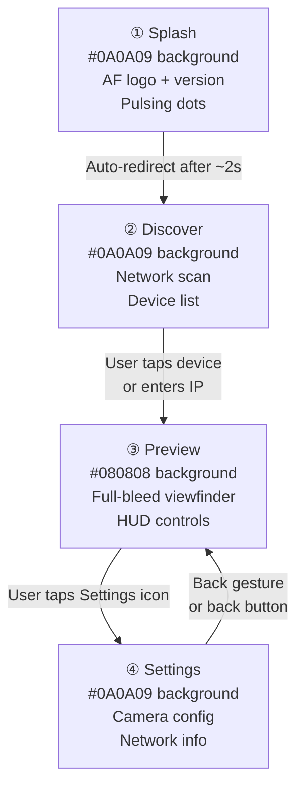
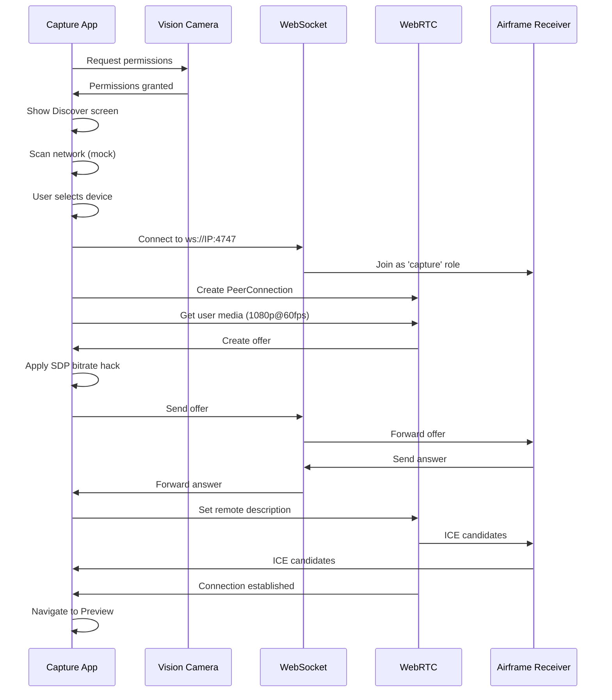
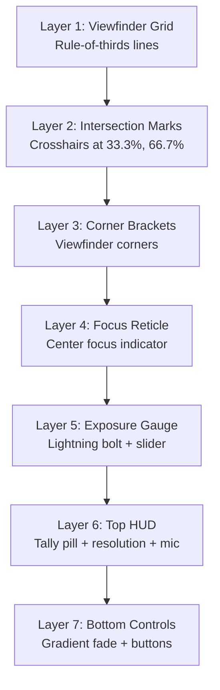

# Airframe Capture App

A React Native + Expo mobile application that captures camera feed and streams it via WebRTC to the Airframe receiver. Designed for live production use with a professional viewfinder interface.

## Overview

The Airframe capture app is a live production transmitter that turns a mobile device into a professional camera source. It features a sophisticated multi-screen architecture with proper design system adherence, network discovery, and real-time streaming capabilities.

## Features

- **Multi-Screen Architecture**: Splash → Discover → Preview → Settings
- **Network Discovery**: Automatic receiver discovery on local network
- **Manual IP Entry**: Fallback for manual connection
- **Professional Viewfinder**: Rule-of-thirds grid, corner brackets, focus reticle
- **Real-time Metrics**: Resolution, bitrate, elapsed time display
- **Live Tally System**: LIVE/STANDBY status indicators
- **Camera Controls**: Mic toggle, flip horizontal, exposure gauge
- **Design System**: Dark-only UI with proper typography (Figtree + DM Mono)
- **WebRTC Streaming**: 1920x1080 @ 60fps video with audio
- **SDP Bitrate Control**: Enforced 20 Mbps limit for quality

## Tech Stack

- **React Native**: 0.86.0
- **Expo**: ~57.0.4
- **react-native-vision-camera**: ^5.1.0
- **react-native-webrtc**: ^124.0.7
- **lucide-react-native**: ^1.23.0
- **expo-linear-gradient**: ^57.0.0
- **expo-font**: ^57.0.0
- **@expo-google-fonts/figtree**: ^0.4.1
- **@expo-google-fonts/dm-mono**: ^0.4.2
- **TypeScript**: ~6.0.3

## Screen Architecture



## Design Philosophy

The app is designed as a **live production transmitter**, not a media player or social app. Every screen must work at a glance, with one hand, under pressure.

**Core principles:**
- **Dark-only UI**: Every screen uses `#0A0A09` or `#080808` as the base
- **Black/white primary**: All structural chrome is white-on-black at reduced opacity
- **Mono for machine values**: IP addresses, bitrates, resolutions use DM Mono
- **Functional motion only**: No decorative animations
- **Camera metaphor**: Preview screen is a viewfinder, controls at edges
- **Two-channel status**: Connection quality via color AND text label

## Typography System

**Two fonts. One rule.**

- **Figtree**: Human-authored text (headings, labels, device names, button text)
- **DM Mono**: Machine-generated values (IPs, bitrates, resolutions, fps, version strings)

| Role | Font | Weight | Size | Opacity |
|------|------|--------|------|---------|
| Screen heading | Figtree | 600 | 22px | 100% white |
| App namespace | DM Mono | 400 | 10px | 30% white, uppercase |
| Device name | Figtree | 500 | 14px | 100% white |
| Device IP | DM Mono | 400 | 12px | 35% white |
| Resolution badge | DM Mono | 400 | 12px | 55% white |
| Tally label | DM Mono | 500 | 12px | varies by state |

## Development

### Prerequisites

- Node.js 18 or higher
- Expo CLI: `npm install -g expo-cli`
- iOS: Xcode 15+ (for iOS development)
- Android: Android Studio with SDK 34+ (for Android development)

### Installation

```bash
cd capture-app
npm install
```

### Running the App

```bash
# Start Expo development server
npm start

# Run on iOS
npm run ios

# Run on Android
npm run android
```

### Building for Production

```bash
# Build iOS app
eas build --platform ios

# Build Android app
eas build --platform android
```

## Architecture

### Component Structure

```
capture-app/
├── App.tsx                 # Main app with navigation and WebRTC logic
├── screens/
│   ├── SplashScreen.tsx    # Brand splash with auto-redirect
│   ├── DiscoverScreen.tsx  # Network discovery and device list
│   ├── PreviewScreen.tsx   # Viewfinder with HUD controls
│   └── SettingsScreen.tsx  # Camera configuration
├── ErrorBoundary.tsx       # Error handling wrapper
├── MOBILE_APP_DESIGN.md    # Complete design specification
└── package.json
```

### WebRTC Connection Flow



### State Management

The app uses React hooks for state management:

```typescript
// App.tsx state
const [screen, setScreen] = useState<Screen>('splash');
const [targetIp, setTargetIp] = useState<string>('');
const [peerConnected, setPeerConnected] = useState<boolean>(false);
const [connectionError, setConnectionError] = useState<string | null>(null);

// PreviewScreen state
const [isLive, setIsLive] = useState<boolean>(false);
const [isMuted, setIsMuted] = useState<boolean>(false);
const [elapsed, setElapsed] = useState<number>(0);
```

## Key Implementation Details

### SDP Bitrate Hack

The app modifies the SDP to enforce a 20 Mbps bitrate limit for quality:

```typescript
let sdp = offer.sdp;
if (sdp && sdp.includes("b=AS:")) {
  sdp = sdp.replace(/b=AS:\d+/g, "b=AS:20000");
} else if (sdp) {
  sdp = sdp.replace(/c=IN IP4 .*\r\n/g, "$&b=AS:20000\r\n");
}
offer.sdp = sdp;
```

### Camera Configuration

Optimal streaming configuration:

```typescript
const stream = await mediaDevices.getUserMedia({
  video: {
    width: { ideal: 1920 },
    height: { ideal: 1080 },
    frameRate: { ideal: 60 },
    facingMode: "environment"
  },
  audio: true
});
```

### Viewfinder Layers

The Preview screen uses layered composition:



### Network Discovery

Currently uses mock devices for UI demonstration. Future implementation should include:

- mDNS/Bonjour service discovery
- UDP broadcast discovery
- Zeroconf integration

## Design Tokens

### Colors

| Token | Value | Usage |
|-------|-------|-------|
| `surface.base` | `#0A0A09` | Page background |
| `surface.preview` | `#080808` | Preview screen |
| `surface.card` | `rgba(255,255,255,0.05)` | Cards |
| `text.primary` | `#FFFFFF` | Main labels |
| `text.secondary` | `rgba(255,255,255,0.45)` | Subtitles |
| `accent.blue` | `#4D8AFF` | Connect button, focus |
| `signal.good` | `#34C759` | Signal bars, healthy |
| `tally.live` | `#EF4444` | Live tally button |

### Border Radius

| Token | Value | Usage |
|-------|-------|-------|
| `radius.sm` | `10px` | Small chips, badges |
| `radius.md` | `14px` | Buttons, inputs |
| `radius.lg` | `18px` | Cards, device rows |
| `radius.full` | `9999px` | Pills, dots |

## Error Handling

The app includes comprehensive error handling:

- **ErrorBoundary**: Catches React rendering errors
- **WebSocket errors**: Connection failure detection
- **WebRTC errors**: Initialization failure handling
- **Permission errors**: Camera/mic permission denial

## Future Enhancements

- Real network discovery (mDNS/UDP broadcast)
- Camera settings (resolution, frame rate, bitrate)
- Audio level monitoring
- Recording capability
- Multi-receiver support
- Stream statistics overlay

## License

See LICENSE file for details.
